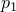

# *CONTACT CONTROLS

### *CONTACT CONTROLSSpecify additional controls for contact.

This option is used to provide additional optional solution controls for models involving contact between bodies. The standard solution controls are usually sufficient, but additional controls are helpful to obtain cost-effective solutions for models involving complicated geometries and numerous contact interfaces, as well as for models in which rigid body motions are initially not constrained.

The [*CONTACT CONTROLS](ch03abk57.md) option can be repeated to set different control values for different contact pairs. It must be used in conjunction with the [*CONTACT PAIR](ch03abk68.md) option in Abaqus/Explicit analyses.

**Products: **Abaqus/Standard  Abaqus/Explicit  Abaqus/CAE  

**Type: **History data 

**Level: **Step

**Abaqus/CAE: **Interaction module

##### **References:**

- ["Adjusting contact controls in Abaqus/Standard," Section 36.3.6 of the Abaqus Analysis User's Guide](../usb/usb-link.md#usb-cni-acontactcontrolsstd)
- ["Defining contact pairs in Abaqus/Explicit," Section 36.5.1 of the Abaqus Analysis User's Guide](../usb/usb-link.md#usb-cni-aexpcontactpair)
- ["Contact controls for contact pairs in Abaqus/Explicit," Section 36.5.5 of the Abaqus Analysis User's Guide](../usb/usb-link.md#usb-cni-acontactcontrolsexp)
- [*CONTACT PAIR](ch03abk68.md)

### Specifying additional controls for contact in an Abaqus/Standard analysis

### **Optional, mutually exclusive parameters applicable to augmented Lagrangian constraint enforcement: **

ABSOLUTE PENETRATION TOLERANCE

Set this parameter equal to the allowable penetration. Only contact constraints defined with augmented Lagrangian surface behavior will be affected by this parameter.

RELATIVE PENETRATION TOLERANCE

Set this parameter equal to the ratio of the allowable penetration to the characteristic contact surface face dimension. Only contact constraints defined with augmented Lagrangian surface behavior will be affected by this parameter. By default, the RELATIVE PENETRATION TOLERANCE parameter is set to 0.1% except for finite-sliding, surface-to-surface contact, in which case the default setting is 5%.

### **Optional parameters: **

MASTER

Set this parameter equal to the master surface name to apply the controls to a specific contact pair. This parameter must be used in conjunction with the SLAVE parameter to specify a contact pair.

PERTURBATION TANGENT SCALE FACTOR

Set this parameter equal to the factor by which Abaqus/Standard will scale the default tangential stiffness used for the contact pairs in a particular linear perturbation step. Only contact constraints enforced with penalty methods will be affected by this parameter. This tangential scale factor is activated when a nonzero friction is specified on the data line of the [*FRICTION](ch06abk36.md) option.

PRESSURE DEPENDENT PERTURBATION

Set this parameter equal to the value of the  coefficient controlling the base state contact pressure–dependent enforcement of contact constraints in a particular linear perturbation step. This parameter allows you to relax or remove both normal and tangential contact constraints with low pressure.

RESET

Include this parameter to reset all contact controls to their default values. This parameter cannot be used with any other parameters, except for the SLAVE and MASTER parameters. When this parameter is used in conjunction with the SLAVE and MASTER parameters, the controls applied to the specific contact pair are removed.

SLAVE

Set this parameter equal to the slave surface name to apply the controls to a specific contact pair. This parameter must be used in conjunction with the MASTER parameter to specify a contact pair.

STABILIZE

Include this parameter to address situations where rigid body modes exist as long as contact is not fully established. This parameter activates damping in the normal and tangential directions based on the stiffness of the underlying mesh and the time step size. If no value is assigned to this parameter, Abaqus calculates the damping coefficient automatically. If a numerical value is assigned to this parameter, Abaqus multiplies the automatically calculated damping coefficient by this value. If the damping coefficient is defined directly on the data line, any numerical value assigned to this parameter is ignored.

Set STABILIZE =USER ADAPTIVE to scale the automatically calculated damping coefficient or the damping coefficient specified on the data line by a factor that decreases over iterations within one increment, according to the pattern specified on the second data line.

The STABILIZE parameter can be used to specify damping for the whole model or for an individual contact pair by using the SLAVE and MASTER parameters. Values specified for a specific contact pair override the values for the whole model, if given.

STIFFNESS SCALE FACTOR

Set this parameter equal to the factor by which Abaqus/Standard will scale the default penalty stiffness to obtain the stiffnesses used for the contact pairs. 

Set STIFFNESS SCALE FACTOR=USER ADAPTIVE to scale the default penalty stiffness by a factor that increases over iterations of the first increment and remains constant (equal to the last specified value) for subsequent increments.

 This scale factor acts as an additional multiplier on any scale factor specified on the data line of the [*SURFACE BEHAVIOR](ch18abk48.md) option.

TANGENT FRACTION

Set this parameter equal to a fraction of the damping in the normal direction as specified with the STABILIZE parameter. By default, the tangential and normal stabilization are the same.

### **Optional data line if the PRESSURE DEPENDENT PERTURBATION parameter is included: **

**First (and only) line:**

### **Optional data lines if the STABILIZE parameter is included: **

**First line:**

**Second line (required if STABILIZE=USER ADAPTIVE):**

### **Optional data line if STIFFNESS SCALE FACTOR=USER ADAPTIVE: **

**Third line if STABILIZE=USER ADAPTIVE; otherwise, first line:**

### Specifying additional controls for contact in an Abaqus/Explicit analysis

**Warning:**These controls are intended for experienced analysts and should be used with care. Using nondefault values of these controls may greatly increase the computational time of the analysis or produce inaccurate results.

### **Required parameter: **

CPSET

Set this parameter equal to the name of the contact pair set associated with this contact controls definition. The contact controls defined with this option will be applied to all contact pairs having this contact pair set name.

### **Optional parameters: **

FASTLOCALTRK

Set FASTLOCALTRK=NO if contact is not being enforced appropriately. A more conservative local tracking method will be used that may resolve the error. The default is FASTLOCALTRK=YES, which uses a more computationally efficient local tracking method.

GLOBTRKINC

Set this parameter equal to the maximum number of increments between global contact searches. The default is 100 increments for two-surface contact and 4 increments for self-contact.

RESET

Include this parameter to reset all of the optional controls to their default values. Those controls that are explicitly specified with other parameters on the same [*CONTACT CONTROLS](ch03abk57.md) option are not reset. If this parameter is omitted, only the explicitly specified controls will be changed in the current step; the others will remain at their previous settings.

SCALE PENALTY

Set this parameter equal to the factor by which Abaqus/Explicit will scale the default penalty stiffnesses to obtain the stiffnesses used for the penalty contact pairs within the contact pair set specified with the CPSET parameter. Penalty contact constraints defined with softened surface behavior and kinematic contact constraints will not be affected by this parameter. By default, the SCALE PENALTY parameter is set to unity.

WARP CHECK PERIOD

Set this parameter equal to the number of increments between checks for highly warped facets on master surfaces. By default, this check is performed every 20 increments. More frequent checks will cause a slight increase in computational time.

WARP CUT OFF

Set this parameter equal to the out-of-plane warping angle, measured in degrees, at which a facet will be considered to be highly warped. The out-of-plane warping angle is defined as the amount of variation of the surface normal over a facet. The default is WARP CUT OFF=20.

**There are no data lines associated with this option.**

