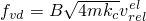
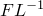
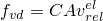

# *CONTACT DAMPING

### *CONTACT DAMPINGDefine viscous damping between contacting surfaces.

This option is used to define viscous damping between two interacting surfaces. It must be used in conjunction with the [*SURFACE INTERACTION](ch18abk50.md), the [*GAP](ch07abk01.md), or the [*INTERFACE](ch09abk22.md) option. In Abaqus/Standard this option is primarily used to damp relative motions of the surfaces during approach or separation. In Abaqus/Explicit this option is used to damp oscillations when using penalty or softened contact. This option is not applicable if user subroutine [`VUINTER`](../sub/sub-link.md#sub-xsl-vuinter) or [`VUINTERACTION`](../sub/sub-link.md#sub-xsl-vuinteraction) is specified for the surface interaction.

**Products: **Abaqus/Standard  Abaqus/Explicit  Abaqus/CAE  

**Type: **Model data in Abaqus/Standard; Model or history data in Abaqus/Explicit  

**Level: **Part,  Part instance,  Assembly,  Model in Abaqus/Standard; Model or Step in Abaqus/Explicit  

**Abaqus/CAE: **Interaction module

##### **References:**

- ["Mechanical contact properties: overview," Section 37.1.1 of the Abaqus Analysis User's Guide](../usb/usb-link.md#usb-cni-acontactmechanical)
- ["Contact damping," Section 37.1.3 of the Abaqus Analysis User's Guide](../usb/usb-link.md#usb-cni-acontactdamping)

### **Required parameter: **

DEFINITION

Use this parameter to choose the dimensionality of the damping coefficient that is specified on the data line. The only option that is available in an Abaqus/Standard analysis is DEFINITION=DAMPING COEFFICIENT.

Set DEFINITION=CRITICAL DAMPING FRACTION to use a unitless damping coefficient, *B*. The damping forces are calculated with , where *m* is the nodal mass,  is the nodal contact stiffness (in units of ), and  is the rate of relative elastic slip between the surfaces. A default value of *B*=0.03 is used for kinematic contact with softened behavior and penalty contact.

Set DEFINITION=DAMPING COEFFICIENT to specify damping in terms of a damping coefficient, *C*, with units of pressure per relative velocity such that the damping forces will be calculated with , where *A* is the nodal area and  is the rate of relative elastic slip between the surfaces. If a contact area is not defined, such as may occur for node-based surfaces or for GAP- or ITT-type contact elements, coefficient units are force per relative velocity. For contact with three-dimensional beams or trusses, coefficient units are force per unit length per unit velocity.

### **Optional parameter: **

TANGENT FRACTION

Set this parameter equal to the tangential damping coefficient divided by the normal damping coefficient. This parameter affects only the tangential damping; the normal direction damping coefficient is defined on the data line below. Set this parameter equal to zero if no tangential damping is desired. The default is 0.0 in Abaqus/Standard and 1.0 in Abaqus/Explicit.

### **Data line to define viscous damping in the normal direction between the contacting surfaces: **

**First (and only) line:**

