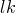
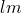
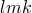
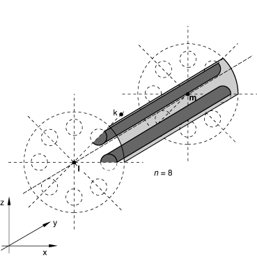

# *CYCLIC

### *CYCLICDefine cyclic symmetry for a cavity radiation heat transfer analysis.

This option is used to define cavity symmetry by cyclic repetition about a point or an axis. The [*CYCLIC](ch03abk90.md) option can be used only following the [*RADIATION SYMMETRY](ch17abk05.md) option.

**Products: **Abaqus/Standard  Abaqus/CAE  

**Type: **History data 

**Level: **Step

**Abaqus/CAE: **Interaction module

##### **References:**

- ["Cavity radiation," Section 41.1.1 of the Abaqus Analysis User's Guide](../usb/usb-link.md#usb-cni-acavityradiation)
- [*RADIATION SYMMETRY](ch17abk05.md)

### **Required parameters: **

NC

Set this parameter equal to the number of cyclically similar images that compose the cavity formed as a result of this symmetry. The angle of rotation (about a point or an axis) used to create cyclically similar images is equal to 360/NC.

TYPE

Set TYPE=POINT to create a two-dimensional cavity by cyclic repetition of the cavity surface defined in the model by rotation about a point, *l*. See [Figure 3.90--1](ch03abk90.md#kcyclic-point). The cavity surface defined in the model must be bounded by the line  and a line passing through *l* at an angle, measured counterclockwise when looking into the plane of the model, of 360/NC to .

Set TYPE=AXIS to create a three-dimensional cavity by cyclic repetition of the cavity surface defined in the model by rotation about an axis, . See [Figure 3.90--2](ch03abk90.md#kcyclic-axis). The cavity surface defined in the model must be bounded by the plane  and a plane passing through line  at an angle, measured clockwise when looking from *l* to *m*, of 360/NC to . Line  must be normal to line .

### **Data line to define cyclic symmetry for a two-dimensional cavity (TYPE=POINT): **

**First (and only) line:**

### **Data lines to define cyclic symmetry for a three-dimensional cavity (TYPE=AXIS): **

**First line:**

**Second line:**

**Figure 3.90–1** [*CYCLIC](ch03abk90.md), TYPE=POINT option.

**Figure 3.90–2** [*CYCLIC](ch03abk90.md), TYPE=AXIS option.

