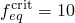
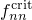
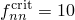
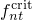
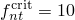
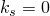
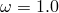
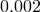
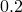

# *DAMAGE INITIATION

### *DAMAGE INITIATIONSpecify material and contact properties to define the initiation of damage.

This option is used to provide material properties that define the initiation of damage. It can also be used in conjunction with the [*SURFACE INTERACTION](ch18abk50.md) option to define a contact property model that allows definition of damage initiation for cohesive surfaces.

**Products: **Abaqus/Standard  Abaqus/Explicit  Abaqus/CAE  

**Type: **Model data  

**Level: **Model  

**Abaqus/CAE: **Property module

##### **References:**

- ["Damage initiation for ductile metals," Section 24.2.2 of the Abaqus Analysis User's Guide](../usb/usb-link.md#usb-mat-cdamageinitductile)
- ["Damage initiation for fiber-reinforced composites," Section 24.3.2 of the Abaqus Analysis User's Guide](../usb/usb-link.md#usb-mat-cdamageinitfibercomposite)
- ["Damage initiation for ductile materials in low-cycle fatigue," Section 24.4.2 of the Abaqus Analysis User's Guide](../usb/usb-link.md#usb-mat-cdamageinitfatigue)
- ["Defining the constitutive response of cohesive elements using a traction-separation description," Section 32.5.6 of the Abaqus Analysis User's Guide](../usb/usb-link.md#usb-elm-ecohesivebehavior)
- ["Modeling discontinuities as an enriched feature using the extended finite element method," Section 10.7.1 of the Abaqus Analysis User's Guide](../usb/usb-link.md#usb-anl-aenrichment)
- ["Surface-based cohesive behavior," Section 37.1.10 of the Abaqus Analysis User's Guide](../usb/usb-link.md#usb-cni-acohesivebehavior)
- ["UDMGINI," Section 1.1.26 of the Abaqus User Subroutines Reference Guide](../sub/sub-link.md#sub-rtn-uudmgini)

### Defining damage initiation as a material property

### **Required parameter: **

CRITERION

Set CRITERION=DUCTILE to specify a damage initiation criterion based on the ductile failure strain.

Set CRITERION=FLD to specify a damage initiation criterion based on a forming limit diagram.

Set CRITERION=FLSD to specify a damage initiation criterion based on a forming limit stress diagram.

Set CRITERION=HASHIN to specify damage initiation criteria based on the Hashin analysis.

Set CRITERION=HYSTERESIS ENERGY to specify damage initiation criteria based on the inelastic hysteresis energy dissipated per stabilized cycle in a low-cycle fatigue analysis.

Set CRITERION=JOHNSON COOK to specify a damage initiation criterion based on the Johnson-Cook failure strain.

Set CRITERION=MAXE to specify a damage initiation criterion based on the maximum nominal strain for cohesive elements or enriched elements.

Set CRITERION=MAXS to specify a damage initiation criterion based on the maximum nominal stress criterion for cohesive elements or enriched elements.

Set CRITERION=MAXPE to specify a damage initiation criterion based on the maximum principal strain for enriched elements.

Set CRITERION=MAXPS to specify a damage initiation criterion based on the maximum principal stress criterion for enriched elements.

Set CRITERION=MK to specify a damage initiation criterion based on a Marciniak-Kuczynski analysis.

Set CRITERION=MSFLD to specify a damage initiation criterion based on the Mschenborn and Sonne forming limit diagram.

Set CRITERION=QUADE to specify a damage initiation based on the quadratic separation-interaction criterion for cohesive elements or enriched elements.

Set CRITERION=QUADS to specify a damage initiation based on the quadratic traction-interaction criterion for cohesive elements or enriched elements.

Set CRITERION=SHEAR to specify a damage initiation criterion based on the shear failure strain.

Set CRITERION=USER to specify a user-defined damage initiation criterion for enriched elements.

### **Optional parameters: **

ALPHA

This parameter can be used only in conjunction with CRITERION=HASHIN.

Set this parameter equal to the value of the coefficient that will multiply the shear contribution to the Hashin's fiber initiation criterion.  The default value is .

DEFINITION

This parameter can be used only in conjunction with CRITERION=MSFLD.

Set DEFINITION=MSFLD (default)  to specify the MSFLD damage initiation criterion by providing the limit equivalent plastic strain as a tabular function of .

Set DEFINITION=FLD to specify the MSFLD damage initiation criterion by providing the limit major strain as a tabular function of minor strain.

DEPENDENCIES

Set this parameter equal to the number of field variables included in the definition of the damage initiation properties. If this parameter is omitted, it is assumed that the damage initiation properties are constant or depend only on temperature. This parameter cannot be used with CRITERION=JOHNSON COOK.

FAILURE MECHANISMS

This parameter can be used only in conjunction with CRITERION=USER.

Set this parameter equal to the total number of failure mechanisms to be specified in a user-defined damage initiation criterion. This parameter value must be a nonzero.

FEQ

This parameter can be used only in conjunction with CRITERION=MK.

Set this parameter equal to the critical value of the deformation severity index for equivalent plastic strains, . The default value is . 

Set this parameter equal to zero if the deformation severity factor for equivalent plastic strains should not be considered for the evaluation of the Marciniak-Kuczynski criterion.

FNN

This parameter can be used only in conjunction with CRITERION=MK.

Set this parameter equal to the critical value of the deformation severity index for strains normal to the groove direction, . The default value is .

Set this parameter equal to zero if the deformation severity factor for strains normal to the groove should not be considered for the evaluation of the Marciniak-Kuczynski criterion.

FNT

This parameter can be used only in conjunction with CRITERION=MK.

Set this parameter equal to the critical value of the deformation severity index for shear strains, . The default value is .

Set this parameter equal to zero if the deformation severity factor for shear strains should not be considered for the evaluation of the Marciniak-Kuczynski criterion.

FREQUENCY

This parameter can be used only in conjunction with CRITERION=MK.

Set this parameter equal to the frequency, in increments, at which the Marciniak-Kuczynski analysis is going to be performed. By default, the M-K analysis is performed every increment; that is, FREQUENCY=1.

KS

This parameter can be used only in conjunction with CRITERION=SHEAR.

Set this parameter equal to the value of . The default value is .

LODE DEPENDENT

Include this parameter to define a ductile damage initiation criterion that depends on the Lode angle.

NORMAL DIRECTION

This parameter can be used only in conjunction with CRITERION=MAXE, CRITERION=MAXS, CRITERION=QUADE, or CRITERION=QUADS for enriched elements in Abaqus/Standard.

Set NORMAL DIRECTION=1 (default) to specify that a new crack orthogonal to the element local 1-direction will be introduced when the damage initiation criterion is satisfied.

Set NORMAL DIRECTION=2 to specify that a new crack orthogonal to the element local 2-direction will be introduced when the damage initiation criterion is satisfied.

NUMBER IMPERFECTIONS

This parameter can be used only in conjunction with CRITERION=MK.

Set this parameter equal to the number of imperfections to be considered for the evaluation of the Marciniak-Kuczynski analysis. These imperfections are assumed to be equally spaced in the angular direction. By default, four imperfections are used.

OMEGA

This parameter can be used only in conjunction with CRITERION=MSFLD in Abaqus/Explicit.

Set this parameter equal to the factor  used for filtering the ratio of principal strain rates used for the evaluation of the MSFLD damage initiation criterion. The default value is .

PEINC

This parameter can be used only in conjunction with CRITERION=MSFLD in Abaqus/Explicit.

Set this parameter equal to the accumulated increment in equivalent plastic strain used to trigger the evaluation of the MSFLD damage initiation criterion. The default value is  ( %).

POSITION

This parameter can be used only in conjunction with CRITERION=MAXPE, CRITERION=MAXPS,  CRITERION=MAXE, CRITERION=MAXS, CRITERION=QUADE, CRITERION=QUADS, or CRITERION=USER for enriched elements in Abaqus/Standard.

Set POSITION=CENTROID (default) to use the stress/strain at the element centroid ahead of the crack tip to determine if the damage initiation criterion is satisfied and to determine the crack propagation direction (if needed).

Set POSITION=COMBINED to use the stress/strain extrapolated to the crack tip to determine if the damage initiation criterion is satisfied and to use the stress/strain at the element centroid to determine the crack propagation direction (if needed).

Set POSITION=CRACKTIP to use the stress/strain extrapolated to the crack tip to determine if the damage initiation criterion is satisfied and to determine the crack propagation direction (if needed).

Set POSITION=NONLOCAL to use the stress/strain extrapolated to the crack tip to determine if the damage initiation criterion is satisfied and to use the stress/strain averaged over a group of elements around the crack tip in the enriched region to determine the crack propagation direction (if needed). This option can be used only in conjunction with CRITERION=MAXPE or CRITERION=MAXPS.

PROPERTIES

This parameter can be used only in conjunction with CRITERION=USER.

Set this parameter equal to the number of material constants being specified for a user-defined damage initiation criterion. The parameter value must be a nonzero value.

R CRACK DIRECTION

This parameter can be used only in conjunction with POSITION=NONLOCAL.

Set this parameter equal to the radius around the crack tip within which the elements are included for calculating the averaged stress/strain used to obtain the crack propagation direction. The default value is three times the typical element characteristic length in the enriched region.

TOLERANCE

This parameter can be used only in conjunction with CRITERION=MAXPE, CRITERION=MAXPS,  CRITERION=MAXE, CRITERION=MAXS, CRITERION=QUADE, CRITERION=QUADS, or CRITERION=USER for enriched elements in Abaqus/Standard.

Set this parameter equal to the tolerance within which the damage initiation criterion must be satisfied. The default is 0.05.

### **Data lines to specify damage initiation for CRITERION=DUCTILE without the LODE DEPENDENT parameter: **

**First line:**

**Subsequent lines (only needed if the DEPENDENCIES parameter has a value greater than four):**

Repeat this set of data lines as often as necessary to define the equivalent plastic strain at damage initiation as a function of triaxiality, strain rate, temperature, and other predefined field variables.

### **Data lines to specify damage initiation for CRITERION=DUCTILE, LODE DEPENDENT: **

**First line:**

**Subsequent lines (only needed if the DEPENDENCIES parameter has a value greater than three):**

Repeat this set of data lines as often as necessary to define the equivalent plastic strain at damage initiation as a function of triaxiality, Lode angle, strain rate, temperature, and other predefined field variables.

### **Data lines to specify damage initiation for CRITERION=FLD: **

**First line:**

**Subsequent lines (only needed if the DEPENDENCIES parameter has a value greater than five):**

Repeat this set of data lines as often as necessary to define the major principal strain at damage initiation as a function of minor principal strain, temperature, and other predefined field variables.

### **Data lines to specify damage initiation for CRITERION=FLSD: **

**First line:**

**Subsequent lines (only needed if the DEPENDENCIES parameter has a value greater than five):**

Repeat this set of data lines as often as necessary to define the major principal stress at damage initiation as a function of minor principal stress, temperature, and other predefined field variables.

### **Data lines to specify damage initiation for CRITERION=HASHIN: **

**First line:**

**Subsequent lines (only needed if the DEPENDENCIES parameter has a value greater than one):**

Repeat this set of data lines as often as necessary to define the dependence of the strengths on temperature and other predefined field variables.

### **Data lines to specify damage initiation for CRITERION=HYSTERESIS ENERGY: **

**First line:**

**Subsequent lines (only needed if the DEPENDENCIES parameter has a value greater than five):**

Repeat this set of data lines as often as necessary to define the dependence of material constants on temperature and other predefined field variables.

### **Data lines to specify damage initiation for CRITERION=JOHNSON COOK: **

**First (and only) line:**

### **Data lines to specify damage initiation for CRITERION=MK: **

**First line:**

**Subsequent lines (only needed if the DEPENDENCIES parameter has a value greater than five):**

Repeat this set of data lines as often as necessary to define the groove size as a function of angular distance, temperature, and other predefined field variables.

### **Data lines to specify damage initiation for CRITERION=MSFLD, DEFINITION=MSFLD: **

**First line:**

**Subsequent lines (only needed if the DEPENDENCIES parameter has a value greater than four):**

Repeat this set of data lines as often as necessary to define the equivalent plastic strain at damage initiation as a function of , equivalent plastic strain rate, temperature, and other predefined field variables.

### **Data lines to specify damage initiation for CRITERION=MSFLD, DEFINITION=FLD: **

**First line:**

**Subsequent lines (only needed if the DEPENDENCIES parameter has a value greater than four):**

Repeat this set of data lines as often as necessary to define the major principal strain at damage initiation as a function of minor principal strain, equivalent plastic strain rate, temperature, and other predefined field variables.

### **Data lines to specify damage initiation for CRITERION=QUADE or CRITERION=MAXE: **

**First line:**

**Subsequent lines (only needed if the DEPENDENCIES parameter has a value greater than four):**

Repeat this set of data lines as often as necessary to define the maximum normal and shear tractions at damage initiation as a function of temperature and other predefined field variables.

### **Data lines to specify damage initiation for CRITERION=QUADS or CRITERION=MAXS: **

**First line:**

**Subsequent lines (only needed if the DEPENDENCIES parameter has a value greater than four):**

Repeat this set of data lines as often as necessary to define the maximum normal and shear tractions at damage initiation as a function of temperature and other predefined field variables.

### **Data lines to specify damage initiation for CRITERION=MAXPE: **

**First line:**

**Subsequent lines (only needed if the DEPENDENCIES parameter has a value greater than six):**

Repeat this set of data lines as often as necessary to define the maximum principal strain at damage initiation as a function of temperature and other predefined field variables.

### **Data lines to specify damage initiation for CRITERION=MAXPS: **

**First line:**

**Subsequent lines (only needed if the DEPENDENCIES parameter has a value greater than six):**

Repeat this set of data lines as often as necessary to define the maximum principal stress at damage initiation as a function of temperature and other predefined field variables.

### **Data lines to specify damage initiation for CRITERION=SHEAR: **

**First line:**

**Subsequent lines (only needed if the DEPENDENCIES parameter has a value greater than four):**

Repeat this set of data lines as often as necessary to define the equivalent plastic strain at damage initiation as a function of the shear stress ratio, strain rate, temperature, and other predefined field variables.

### **Data lines to specify damage initiation for CRITERION=USER: **

**First line:**

Repeat this data line as often as necessary to define all material constants. 

### Defining damage initiation as part of a contact property model

### **Required parameter: **

CRITERION

Set CRITERION=MAXS to specify a damage initiation criterion based on the maximum nominal stress criterion for cohesive surfaces.

Set CRITERION=MAXU to specify a damage initiation criterion based on the maximum separation criterion for cohesive surfaces.

Set CRITERION=QUADS to specify a damage initiation based on the quadratic traction-interaction criterion for cohesive surfaces.

Set CRITERION=QUADU to specify a damage initiation based on the quadratic separation-interaction criterion for cohesive surfaces.

### **Optional parameter: **

DEPENDENCIES

Set this parameter equal to the number of field variables included in the definition of the damage initiation properties. If this parameter is omitted, it is assumed that the damage initiation properties are constant or depend only on temperature. 

### **Data lines to specify damage initiation for CRITERION=QUADU or CRITERION=MAXU: **

**First line:**

**Subsequent lines (only needed if the DEPENDENCIES parameter has a value greater than four):**

Repeat this set of data lines as often as necessary to define the maximum normal and shear separations at damage initiation as a function of temperature and other predefined field variables.

### **Data lines to specify damage initiation for CRITERION=QUADS or CRITERION=MAXS: **

**First line:**

**Subsequent lines (only needed if the DEPENDENCIES parameter has a value greater than four):**

Repeat this set of data lines as often as necessary to define the maximum normal and shear tractions at damage initiation as a function of temperature and other predefined field variables.

