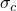
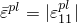
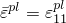
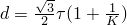
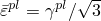
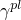

# *DRUCKER PRAGER HARDENING

### *DRUCKER PRAGER HARDENINGSpecify hardening for Drucker-Prager plasticity models.

This option is used to specify the hardening data for elastic-plastic materials that use any of the generalized Drucker-Prager yield criteria defined in the [*DRUCKER PRAGER](ch04abk34.md) option.

This option is also used in Abaqus/Standard analyses to specify the type of creep test with which the creep laws defined in the [*DRUCKER PRAGER CREEP](ch04abk35.md) option are measured. It must be used in conjunction with the [*DRUCKER PRAGER](ch04abk34.md) option and, if creep material behavior is included in an Abaqus/Standard analysis, with the [*DRUCKER PRAGER CREEP](ch04abk35.md) option. 

**Products: **Abaqus/Standard  Abaqus/Explicit  Abaqus/CAE  

**Type: **Model data  

**Level: **Model  

**Abaqus/CAE: **Property module

##### **References:**

- ["Extended Drucker-Prager models," Section 23.3.1 of the Abaqus Analysis User's Guide](../usb/usb-link.md#usb-mat-cdruckerprager)
- [*DRUCKER PRAGER](ch04abk34.md)
- [*DRUCKER PRAGER CREEP](ch04abk35.md)

### **Optional parameters: **

DEPENDENCIES

Set this parameter equal to the number of field variable dependencies included in the definition of the yield stress, in addition to temperature. If this parameter is omitted, the yield stress depends only on the plastic strain and, possibly, on temperature. See “Using the DEPENDENCIES parameter to define field variable dependence”  in ["Material data definition," Section 21.1.2 of the Abaqus Analysis User's Guide](../usb/usb-link.md#usb-mat-cmaterialdata), for more information.

RATE

Set this parameter equal to the equivalent plastic strain rate, , for which this hardening curve applies. This parameter should be omitted if the [*RATE DEPENDENT](ch17abk08.md) option or the [*DRUCKER PRAGER CREEP](ch04abk35.md) option is used. Rate-independent behavior is assumed if the RATE parameter, the [*RATE DEPENDENT](ch17abk08.md) option, and the [*DRUCKER PRAGER CREEP](ch04abk35.md) option are not used.

TYPE

Set TYPE=COMPRESSION (default) to define the hardening behavior by giving the uniaxial compression yield stress, , as a function of uniaxial compression plastic strain, .

Set TYPE=TENSION to define the hardening behavior by giving the uniaxial tension yield stress, , as a function of uniaxial tension plastic strain, .

Set TYPE=SHEAR to define the hardening behavior by giving the cohesion, , as a function of equivalent shear plastic strain, , where  is the yield stress in shear, *K* is the ratio of flow stress in triaxial tension to the flow stress in triaxial compression, and  is the engineering shear plastic strain.

### **Data lines to define Drucker-Prager hardening: **

**First line:**

**Subsequent lines (only needed if the DEPENDENCIES parameter has a value greater than five):**

Repeat this set of data lines as often as necessary to define the dependence of yield stress on plastic strain and, if needed, on temperature and other predefined field variables.

