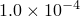

# *DSA CONTROLS

### *DSA CONTROLSSet DSA solution controls.

This option can be used to control the accuracy or efficiency of the DSA computations.

**Product: **Abaqus/Design  

**Type: **Model or history data  

**Level: **Model,  Step

##### **Reference:**

- ["Design sensitivity analysis," Section 19.1.1 of the Abaqus Analysis User's Guide](../usb/usb-link.md#usb-anl-adsa)

### **Optional parameters: **

FORMULATION

Use this parameter to select the design sensitivity analysis formulation type in a multi-increment analysis. This parameter will be ignored if used as history data.

Set FORMULATION=INCREMENTAL (default) to select incremental design sensitivity analysis.

Set FORMULATION=TOTAL to select total design sensitivity analysis.

RESET

Include this parameter to reset the values to those specified on the model data options or to the original default values if no model data options exist. This action takes effect before applying any additional changes to the values.

SIZING FREQUENCY

Set this parameter equal to the frequency in increments (static steps) or modes (frequency steps) at which the default perturbation sizing algorithm is to be executed. The algorithm will always be executed for the first increment or first eigenmode in each step for which DSA calculations are done, even if SIZING FREQUENCY is set to 0. The default is SIZING FREQUENCY=0. 

TOLERANCE

Set this parameter equal to the tolerance to be used with the default perturbation sizing algorithm. The default is TOLERANCE=.

### **Data lines to override the default perturbation sizing algorithm for selected design parameters (The SIZING FREQUENCY and TOLERANCE parameters will be ignored for these design parameters.): **

**First line:**

Repeat this data line for each design parameter for which the default algorithm is to be overridden.

