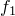
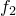

# *EOS

### *EOSSpecify an equation of state model.

This option is used to define a hydrodynamic material model in the form of an equation of state.

**Products: **Abaqus/Explicit  Abaqus/CFD  Abaqus/CAE  

**Type: **Model data  

**Level: **Model  

**Abaqus/CAE: **Property module

##### **Reference:**

- ["Equation of state," Section 25.2.1 of the Abaqus Analysis User's Guide](../usb/usb-link.md#usb-mat-ceos)

### **Required parameter: **

TYPE

Set TYPE=IDEAL GAS for an ideal gas equation of state.

Set TYPE=IGNITION AND GROWTH for an ignition and growth equation of state; if this equation of state is used, the [*REACTION RATE](ch17abk10.md) option and the [*GAS SPECIFIC HEAT](ch07abk07.md) option are required.

Set TYPE=JWL for an explosive equation of state; if this equation of state is used, the [*DETONATION POINT](ch04abk18.md) option is required.

Set TYPE=TABULAR for a tabulated equation of state that is linear in energy. 

Set TYPE=USER for a user-defined equation of state that is defined in user subroutine [`VUEOS`](../sub/sub-link.md#sub-xsl-vueos). 

Set TYPE=USUP for a linear  equation of state. 

### **Optional parameters: **

DETONATION ENERGY

This parameter can be used only in combination with TYPE=IGNITION AND GROWTH.

Set this parameter equal to the energy of detonation. The default value is 0.0.

PROPERTIES

This parameter can be used only if the USER parameter is specified.

Set this parameter equal to the number of property values needed as data in user subroutine [`VUEOS`](../sub/sub-link.md#sub-xsl-vueos). The default value is 0.

### **Data line for an ideal gas equation of state (TYPE=IDEAL GAS): **

**First (and only) line:**

### **Data lines for an ignition and growth equation of state (TYPE=IGNITION AND GROWTH): **

**First line:**

Material constants used in the equation of state for unreacted explosive.

**Second line:**

Material constants used in the equation of state for reacted products.

### **Data line for an explosive equation of state (TYPE=JWL): **

**First (and only) line:**

### **Data line for a tabulated equation of state (TYPE=TABULAR), where the volumetric strain values must be arranged in descending order: **

**First line:**

Repeat this data line as often as necessary to define the dependence of  and  on volumetric strain.

### **Data line for a linear equation of state (TYPE=USUP): **

**First (and only) line:**

### **Data lines to define the material properties for a user-defined equation of state (TYPE=USER): **

**No data lines are needed if the PROPERTIES parameter is omitted or set to 0. Otherwise, first line:**

Repeat this data line as often as necessary to define the material properties.

