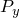

# *FRAME SECTION

### *FRAME SECTIONSpecify a frame section.

This option is used to define the cross-section for frame elements. Since frame section geometry and material descriptions are combined, no [*MATERIAL](ch13abk08.md) reference is associated with this option.

**Product: **Abaqus/Standard  

**Type: **Model data  

**Level: **Part,  Part instance  

##### **References:**

- ["Frame elements," Section 29.4.1 of the Abaqus Analysis User's Guide](../usb/usb-link.md#usb-elm-eframe)
- ["Frame section behavior," Section 29.4.2 of the Abaqus Analysis User's Guide](../usb/usb-link.md#usb-elm-eusingframesection)

### **Required parameter: **

ELSET

Set this parameter equal to the name of the element set for which the section is defined.

### **Optional parameters: **

BUCKLING

Include this parameter to indicate that buckling strut response is permitted for these elements and that the default buckling envelope is to be used. When this parameter is included, the YIELD STRESS parameter is required to determine  and  on the buckling envelope.

To include buckling strut response with a nondefault buckling envelope, use the [*BUCKLING ENVELOPE](ch02abk17.md) option in conjunction with the [*FRAME SECTION](ch06abk34.md) option and the YIELD STRESS parameter. If both the BUCKLING parameter and [*BUCKLING ENVELOPE](ch02abk17.md) option are present, the user-defined buckling envelope takes precedence.

To define effective length factors and added lengths for the first and second cross-section directions with either the default or nondefault buckling envelope, use the [*BUCKLING LENGTH](ch02abk18.md) option in conjunction with the [*FRAME SECTION](ch06abk34.md) option. To define buckling reduction factors for the first and second cross-section directions with either the default or nondefault buckling envelope, use the [*BUCKLING REDUCTION FACTORS](ch02abk19.md) option in conjunction with the [*FRAME SECTION](ch06abk34.md) option.

DENSITY

Set this parameter equal to the mass density per unit volume of the frame element material. This parameter is needed only when the mass of the element is required, such as in dynamic analysis or for gravity loading.

DEPENDENCIES

Set this parameter equal to the number of field variable dependencies included in the definition of material properties, in addition to temperature. If this parameter is omitted, it is assumed that the properties are constant or depend only on temperature. See ["Specifying field variable dependence" in "Material data definition," Section 21.1.2 of the Abaqus Analysis User's Guide](../usb/usb-link.md#usb-mat-cmaterialdata-fvdepen), for more information.

PINNED

Include this parameter to indicate that these elements have uniaxial response only; that is, the ends have pinned connections.

If this parameter is used and both the BUCKLING parameter and the [*BUCKLING ENVELOPE](ch02abk17.md) option are absent, these elements have linear elastic uniaxial response from the beginning of the analysis. If this parameter is used and the BUCKLING parameter or [*BUCKLING ENVELOPE](ch02abk17.md) option are present, these elements have uniaxial response with buckling and postbuckling behavior in compression and isotropic hardening plasticity in tension as described by the buckling envelope option from the beginning of the analysis. The [*BUCKLING LENGTH](ch02abk18.md) option can be used with this parameter when the BUCKLING parameter or [*BUCKLING ENVELOPE](ch02abk17.md) option is present.

This parameter cannot be used with the PLASTIC DEFAULTS parameter or with any of the [*PLASTIC](ch16abk14.md) options.

PLASTIC DEFAULTS

Include this parameter to indicate that elastic-plastic material response is included and that all plastic options are created with default values based on the yield stress defined with the YIELD STRESS parameter. The YIELD STRESS parameter is required when this parameter is used.

To include elastic-plastic material response with user-defined plastic material response, use one or more (as appropriate) of the [*PLASTIC AXIAL](ch16abk15.md), [*PLASTIC M1](ch16abk16.md), [*PLASTIC M2](ch16abk17.md), and [*PLASTIC TORQUE](ch16abk18.md) options in conjunction with the [*FRAME SECTION](ch06abk34.md) option. If the PLASTIC DEFAULTS and YIELD STRESS parameters are omitted, only those plastic options specified will be included in the elastic-plastic material response.

This parameter cannot be used with the PINNED parameter.

SECTION

Set this parameter equal to the name of a library section to choose a standard library section (see ["Beam cross-section library," Section 29.3.9 of the Abaqus Analysis User's Guide](../usb/usb-link.md#usb-elm-ebeamcrosssectlib)). The following cross-sections are available for elastic frame elements (when elastic-plastic and buckling strut response are omitted):

- BOX, for a rectangular, hollow box section.
- CIRC, for a solid circular section.
- GENERAL, for a general cross-section (default).
- I, for an I-beam section.
- PIPE, for a hollow, circular section.
- RECT, for a solid rectangular section.

For elastic-plastic material response the only available plastic interaction surface is an ellipsoid, which is recommended for PIPE cross-sections only. Other cross-section types, except the GENERAL section, can be used at the user's discretion.

For buckling strut response only the PIPE cross-section is available.

YIELD STRESS

Set this parameter equal to the yield stress for the material making up the cross-section.

This parameter is required when defining default elastic-plastic material response with the PLASTIC DEFAULTS parameter and when modeling buckling strut response by using the [*BUCKLING ENVELOPE](ch02abk17.md) option or the BUCKLING parameter.

ZERO

Set this parameter equal to the reference temperature for thermal expansion (), if required. The default is ZERO=0.

### **Data lines for SECTION=GENERAL: **

**First line:**

**Second line (optional; enter a blank line if the default values are to be used):**

The entries on this line must be (0, 0, 1) for FRAME2D elements. The default for FRAME3D elements is (0, 0, 1) if the first element section axis is not defined by an additional node in the element's connectivity. See ["Frame elements," Section 29.4.1 of the Abaqus Analysis User's Guide](../usb/usb-link.md#usb-elm-eframe), for details.

**Third line:**

**Subsequent lines (only needed if the DEPENDENCIES parameter has a value greater than four):**

Repeat this set of data lines as often as necessary to define the properties as a function of temperature and other predefined field variables.

### **Data lines for BOX, CIRC, I, PIPE, and RECT sections: **

**First data line:**

**Second data line (optional; enter a blank line if the default values are to be used):**

The entries on this line must be (0, 0, 1) for FRAME2D elements. The default for FRAME3D elements is (0, 0, –1) if the first element section axis is not defined by an additional node in the element's connectivity. See ["Frame elements," Section 29.4.1 of the Abaqus Analysis User's Guide](../usb/usb-link.md#usb-elm-eframe), for details.

**Third data line:**

**Subsequent lines (only needed if the DEPENDENCIES parameter has a value greater than four):**

Repeat this set of data lines as often as necessary to define the properties as a function of temperature and other predefined field variables.

