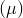

# *GAP FLOW

### *GAP FLOWDefine constitutive parameters for tangential flow in pore pressure cohesive elements.

This option is used to define tangential flow constitutive parameters for pore pressure cohesive elements. It is usually used in a model with hydraulically driven fracture.

**Products: **Abaqus/Standard  Abaqus/CAE  

**Type: **Model data  

**Level: **Model  

**Abaqus/CAE: **Property module

##### **Reference:**

- ["Defining the constitutive response of fluid within the cohesive element gap," Section 32.5.7 of the Abaqus Analysis User's Guide](../usb/usb-link.md#usb-elm-ecohesivefluidbehavior)

### **Optional parameters: **

DEPENDENCIES

Set this parameter equal to the number of field variables included in the definition of the constitutive parameters, in addition to temperature. If this parameter is omitted, it is assumed that the constitutive parameters are constant or depend only on temperature. See ["Specifying field variable dependence" in "Material data definition," Section 21.1.2 of the Abaqus Analysis User's Guide](../usb/usb-link.md#usb-mat-cmaterialdata-fvdepen), for more information.

TYPE

Set TYPE=NEWTONIAN (default) to define the viscosity for a Newtonian fluid.

Set TYPE=POWER LAW to define the consistency and exponent for a power law fluid.

KMAX

Set this parameter equal to the maximum permeability value that should be used. This parameter is meaningful only when TYPE=NEWTONIAN. If this parameter is omitted, Abaqus assumes that the permeability is not bounded.

### **Data lines to define the pore fluid viscosity  (TYPE=NEWTONIAN): **

**First line:**

**Subsequent lines (only needed if the DEPENDENCIES parameter has a value greater than five):**

Repeat this set of data lines as often as necessary to define the variation.

### **Data lines to define the consistency, *K*, and exponent,  (TYPE=POWER LAW): **

**First line:**

**Subsequent lines (only needed if the DEPENDENCIES parameter has a value greater than three):**

Repeat this set of data lines as often as necessary to define the variation.

