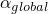
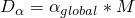
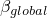
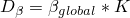
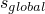
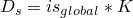

# *GLOBAL DAMPING

### *GLOBAL DAMPINGSpecify global damping.

This option is used to provide global damping factors for the following procedures in Abaqus/Standard: 
- [*COMPLEX FREQUENCY](ch03abk26.md)
- [*MODAL DYNAMIC](ch13abk18.md)
- [*RANDOM RESPONSE](ch17abk07.md)
- [*RESPONSE SPECTRUM](ch17abk15.md)
- [*STEADY STATE DYNAMICS](ch18abk34.md)
- [*STEADY STATE DYNAMICS](ch18abk34.md), DIRECT
- [*STEADY STATE DYNAMICS](ch18abk34.md), SUBSPACE PROJECTION
- [*MATRIX GENERATE](ch13abk12.md)
- [*SUBSTRUCTURE GENERATE](ch18abk42.md)

**Products: **Abaqus/Standard  Abaqus/CAE  

**Type: **History data 

**Level: **Step

**Abaqus/CAE: **Supported in the Step module only for substructure generation.

##### **References:**

- ["Material damping," Section 26.1.1 of the Abaqus Analysis User's Guide](../usb/usb-link.md#usb-mat-cdampingopt)
- ["Damping in dynamic analysis" in "Dynamic analysis procedures: overview," Section 6.3.1 of the Abaqus Analysis User's Guide](../usb/usb-link.md#usb-anl-adynamicproc-damp)
- ["Acoustic, shock, and coupled acoustic-structural analysis," Section 6.10.1 of the Abaqus Analysis User's Guide](../usb/usb-link.md#usb-anl-aacoustic)

### **Optional parameters: **

ALPHA

Set this parameter equal to the  factor to create global Rayleigh mass proportional damping , where  denotes the model mass matrix. The default is ALPHA=0. (Units of [T1](../popups/usb-int-iconventions-unitsym.md).)

BETA

Set this parameter equal to the  factor to create global Rayleigh stiffness proportional damping , where  denotes the model stiffness matrix. The default is BETA=0. (Units of [T](../popups/usb-int-iconventions-unitsym.md).)

FIELD

Set FIELD=ACOUSTIC to apply the global damping only to the acoustic fields in the model.

Set FIELD=ALL (default) to apply the global damping to all of the valid displacement, rotation, and acoustic fields in the model.

Set FIELD=MECHANICAL to apply the global damping only to the valid displacement and rotation fields in the model.

This parameter is not supported in a mode-based steady-state dynamic analysis that uses coupled acoustic-structural modes.

STRUCTURAL

Set this parameter equal to the  factor to create frequency-independent stiffness proportional structural damping , where  denotes the model stiffness matrix. The default is STRUCTURAL=0.

**There are no data lines associated with this option.**

