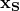
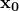

# *INCIDENT WAVE PROPERTY

### *INCIDENT WAVE PROPERTYDefine the geometric data describing an incident wave.

The preferred interface for defining the geometric data for an incident wave is the [*INCIDENT WAVE INTERACTION PROPERTY](ch09abk11.md) option used in conjunction with the [*INCIDENT WAVE INTERACTION](ch09abk10.md) option. The alternative interface uses the [*INCIDENT WAVE PROPERTY](ch09abk12.md) option to define the geometric data for incident waves.

Each [*INCIDENT WAVE](ch09abk08.md) option must refer to an [*INCIDENT WAVE PROPERTY](ch09abk12.md) definition. The [*INCIDENT WAVE PROPERTY](ch09abk12.md) option must be followed by the [*INCIDENT WAVE FLUID PROPERTY](ch09abk09.md) option, which defines the fluid properties used in the incident wave loading.

**Products: **Abaqus/Standard  Abaqus/Explicit  Abaqus/CAE  

**Type: **Model data  

**Level: **Model  

**Abaqus/CAE: **Unsupported; this option has been superseded by incident wave interaction properties.

##### **References:**

- ["Acoustic and shock loads," Section 34.4.6 of the Abaqus Analysis User's Guide](../usb/usb-link.md#usb-prc-pacoustic)
- [*INCIDENT WAVE](ch09abk08.md)
- [*INCIDENT WAVE FLUID PROPERTY](ch09abk09.md)

### **Required parameter: **

NAME

Set this parameter equal to a label that will be used to refer to the incident wave property in the [*INCIDENT WAVE](ch09abk08.md) option.

### **Optional parameter: **

TYPE

Set TYPE=PLANE (default) to specify a planar incident wave.

Set TYPE=SPHERE to specify a spherical incident wave.

### **Data lines to define an incident wave property: **

**First line:**

**Second line:**

If TYPE=PLANE, the vector from  to  defines the direction of the incoming wave; the distance between the two points is unimportant. For incident wave loads using bubble amplitudes, the source positions defined by the user with the [*INCIDENT WAVE PROPERTY](ch09abk12.md) option are interpreted as the initial positions of the source.

