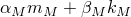
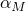
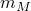

# *MODAL DAMPING

### *MODAL DAMPINGSpecify damping for modal dynamic analysis.

This option is used to specify damping for mode-based procedures. It is usually used in conjunction with the [*SELECT EIGENMODES](ch18abk07.md) option for selecting eigenmodes for modal superposition. If the [*SELECT EIGENMODES](ch18abk07.md) option is not used, all eigenmodes extracted in the prior [*FREQUENCY](ch06abk35.md) step will be used with the damping values specified under the [*MODAL DAMPING](ch13abk17.md) option. If the [*MODAL DAMPING](ch13abk17.md) option is not used, zero damping values are assumed.

**Products: **Abaqus/Standard  Abaqus/CAE  

**Type: **History data 

**Level: **Step

**Abaqus/CAE: **Step module

##### **References:**

- ["Material damping," Section 26.1.1 of the Abaqus Analysis User's Guide](../usb/usb-link.md#usb-mat-cdampingopt)
- ["Dynamic analysis procedures: overview," Section 6.3.1 of the Abaqus Analysis User's Guide](../usb/usb-link.md#usb-anl-adynamicproc)

### **Optional, mutually exclusive parameters (if no parameter is specified, Abaqus assumes that the modal damping coefficients are provided on the data lines): **

MODAL

This parameter is superseded by the VISCOUS parameter. It is recommended that you use the VISCOUS parameter.

Set MODAL=DIRECT to select modal damping using the damping coefficients given in this option. The data lines after the keyword line specify the modal damping values to be used in the analysis.

Set MODAL=COMPOSITE to select composite modal damping using the damping coefficients that have been calculated in the [*FREQUENCY](ch06abk35.md) step (["Natural frequency extraction," Section 6.3.5 of the Abaqus Analysis User's Guide](../usb/usb-link.md#usb-anl-afreqextraction)). These coefficients are calculated from the material damping factors given on the [*DAMPING](ch04abk06.md) material definition option for procedures that use the traditional architecture and from the composite modal damping factors provided on the [*COMPOSITE MODAL DAMPING](ch03abk27.md) option for SIM-based analyses that use the Lanczos eigensolver (["Material damping," Section 26.1.1 of the Abaqus Analysis User's Guide](../usb/usb-link.md#usb-mat-cdampingopt)). Composite modal damping can be used only with DEFINITION=MODE NUMBERS.

RAYLEIGH

This parameter is superseded by the VISCOUS parameter. It is recommended that you use VISCOUS=RAYLEIGH to select Rayleigh damping.

Include this parameter to select Rayleigh damping. The damping term for a particular mode is defined as , where  and  are factors defined on the first data line of the option and  is the modal mass and  is the modal stiffness for mode *M*.

STRUCTURAL

Include this parameter to select structural damping, which means that the damping is proportional to the internal forces but opposite in direction to the velocity. This parameter can be used only with the [*STEADY STATE DYNAMICS](ch18abk34.md), [*RANDOM RESPONSE](ch17abk07.md), or SIM-based [*MODAL DYNAMIC](ch13abk18.md) or [*COMPLEX FREQUENCY](ch03abk26.md) procedures (see ["Mode-based steady-state dynamic analysis," Section 6.3.8 of the Abaqus Analysis User's Guide](../usb/usb-link.md#usb-anl-asteadystdyn); ["Random response analysis," Section 6.3.11 of the Abaqus Analysis User's Guide](../usb/usb-link.md#usb-anl-arandomresponse); ["Transient modal dynamic analysis," Section 6.3.7 of the Abaqus Analysis User's Guide](../usb/usb-link.md#usb-anl-amodaldynamic); and ["Complex eigenvalue extraction," Section 6.3.6 of the Abaqus Analysis User's Guide](../usb/usb-link.md#usb-anl-acomplexfreqextract)). The value of the damping constant, *s*, that multiplies the internal forces is entered on the data line.

VISCOUS

This parameter supersedes the MODAL and RAYLEIGH parameters. It is recommended that you use this parameter.

Set VISCOUS=FRACTION OF CRITICAL DAMPING to select modal damping using the damping coefficients given in this option. The data lines after the keyword line specify the modal damping values to be used in the analysis. 

Set VISCOUS=COMPOSITE to select composite modal damping using the damping coefficients that have been calculated in the [*FREQUENCY](ch06abk35.md) step (["Natural frequency extraction," Section 6.3.5 of the Abaqus Analysis User's Guide](../usb/usb-link.md#usb-anl-afreqextraction)). These coefficients are calculated from the material damping factors given on the [*DAMPING](ch04abk06.md) material definition option for procedures that use the traditional architecture and from the composite modal damping factors provided on the [*COMPOSITE MODAL DAMPING](ch03abk27.md) option for SIM-based analyses that use the Lanczos eigensolver (["Material damping," Section 26.1.1 of the Abaqus Analysis User's Guide](../usb/usb-link.md#usb-mat-cdampingopt)). Composite modal damping can be used only with DEFINITION=MODE NUMBERS.

Set VISCOUS=RAYLEIGH to indicate that the damping for a particular mode is defined as , where  and  are factors defined on the first data line of the option and  is the modal mass and  is the modal stiffness for mode *M*.

### **Optional parameters: **

DEFINITION

Set DEFINITION=MODE NUMBERS (default) to indicate that the damping values are given for the specified mode numbers.

Set DEFINITION=FREQUENCY RANGE to indicate that the damping values are given for the specified frequency ranges. Frequency ranges can be discontinuous.

If both the [*MODAL DAMPING](ch13abk17.md) and [*SELECT EIGENMODES](ch18abk07.md) options are used in the same step, the DEFINITION parameter must be set equal to the same value in both options.

FIELD

Set FIELD=ALL (default) to indicate that the damping values are to be applied to both structural and acoustic modes.

Set FIELD=MECHANICAL to indicate that the damping values are to be applied only to structural modes.

Set FIELD=ACOUSTIC to indicate that the damping values are to be applied only to acoustic modes.

This option can be used only with VISCOUS=FRACTION OF CRITICAL DAMPING or MODAL=DIRECT and DEFINITION=FREQUENCY RANGE for uncoupled structural and acoustic modes obtained through AMS eigenextraction.

### **Data lines to define a fraction of critical damping by specifying mode numbers (if no parameters are specified or if VISCOUS=FRACTION OF CRITICAL DAMPING or MODAL=DIRECT and DEFINITION=MODE NUMBERS): **

**First line:**

Repeat this data line as often as necessary to define modal damping for different modes.

### **Data lines to define Rayleigh damping by specifying mode numbers (VISCOUS=RAYLEIGH or RAYLEIGH and DEFINITION=MODE NUMBERS): **

**First line:**

Repeat this data line as often as necessary to define modal damping for different modes.

### **Data lines to define composite modal damping (VISCOUS=COMPOSITE or MODAL=COMPOSITE): **

**First line:**

Repeat this data line as often as necessary to define modal damping for different modes.

### **Data lines to define structural damping by specifying mode numbers (STRUCTURAL and DEFINITION=MODE NUMBERS): **

**First line:**

Repeat this data line as often as necessary to define modal damping for different modes.

### **Data lines to define a fraction of critical damping by specifying frequency ranges (VISCOUS=FRACTION OF CRITICAL DAMPING or MODAL=DIRECT and DEFINITION=FREQUENCY RANGE): **

**First line:**

Repeat this data line as often as necessary to define modal damping for different frequencies. Abaqus will interpolate linearly between frequencies and keep the damping value constant and equal to the closest specified value outside the frequency range.

### **Data lines to define Rayleigh damping by specifying frequency ranges (VISCOUS=RAYLEIGH or RAYLEIGH and DEFINITION=FREQUENCY RANGE): **

**First line:**

Repeat this data line as often as necessary to define modal damping for different frequencies. Abaqus will interpolate linearly between frequencies and keep the damping value constant and equal to the closest specified value outside the frequency range.

### **Data lines to define structural damping by specifying frequency ranges (STRUCTURAL and DEFINITION=FREQUENCY RANGE): **

**First line:**

Repeat this data line as often as necessary to define modal damping for different frequencies. Abaqus will interpolate linearly between frequencies and keep the damping value constant and equal to the closest specified value outside the frequency range.

