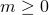

# *MULLINS EFFECT

### *MULLINS EFFECTSpecify Mullins effect material parameters for elastomers.

This option is used to define material constants for the Mullins effect in filled rubber elastomers or for modeling energy dissipation in elastomeric foams. It can be used only with the [*HYPERELASTIC](ch08abk06.md) or the [*HYPERFOAM](ch08abk07.md) options.

**Products: **Abaqus/Standard  Abaqus/Explicit  Abaqus/CAE  

**Type: **Model data  

**Level: **Model  

**Abaqus/CAE: **Property module

##### **References:**

- ["Hyperelastic behavior of rubberlike materials," Section 22.5.1 of the Abaqus Analysis User's Guide](../usb/usb-link.md#usb-mat-chyperelastic)
- ["Hyperelastic behavior in elastomeric foams," Section 22.5.2 of the Abaqus Analysis User's Guide](../usb/usb-link.md#usb-mat-chyperfoam)
- ["Mullins effect," Section 22.6.1 of the Abaqus Analysis User's Guide](../usb/usb-link.md#usb-mat-cmullins)
- ["Energy dissipation in elastomeric foams," Section 22.6.2 of the Abaqus Analysis User's Guide](../usb/usb-link.md#usb-mat-cfoamdissipation)
- ["UMULLINS," Section 1.1.45 of the Abaqus User Subroutines Reference Guide](../sub/sub-link.md#sub-rtn-uumullins)
- ["VUMULLINS," Section 1.2.21 of the Abaqus User Subroutines Reference Guide](../sub/sub-link.md#sub-rtn-uexpumullins)
- [*BIAXIAL TEST DATA](ch02abk09.md)
- [*PLANAR TEST DATA](ch16abk13.md)
- [*UNIAXIAL TEST DATA](ch20abk04.md)

### **Optional, mutually exclusive parameters: **

TEST DATA INPUT

Include this parameter if the material constants are to be computed by Abaqus from data taken from simple tests on a material specimen. If this parameter is omitted, the material constants can be given directly on the data lines or the damage variable can be defined through user subroutine [`UMULLINS`](../sub/sub-link.md#sub-xsl-umullins)  in Abaqus/Standard or [`VUMULLINS`](../sub/sub-link.md#sub-xsl-vumullins) in Abaqus/Explicit.

USER

Include this parameter if the damage variable defining the Mullins effect is defined in user subroutine [`UMULLINS`](../sub/sub-link.md#sub-xsl-umullins) in Abaqus/Standard or [`VUMULLINS`](../sub/sub-link.md#sub-xsl-vumullins) in Abaqus/Explicit.

### **Optional parameters: **

BETA

This parameter can be used only when the TEST DATA INPUT parameter is used; it defines the value of  while the other coefficients of the Mullins effect model are fitted from the test data. It cannot be specified if both the R and M parameters are also specified (use the data line instead to specify all three parameters). If this parameter is omitted,  will be determined from a nonlinear, least-squares fit of the test data. Allowable values of BETA are . The M and BETA parameters cannot both be zero.

DEPENDENCIES

Set this parameter equal to the number of field variables, in addition to temperature, on which the material parameters depend. If this parameter is omitted, it is assumed that the material parameters are constant or depend only on temperature. See ["Specifying field variable dependence" in "Material data definition," Section 21.1.2 of the Abaqus Analysis User's Guide](../usb/usb-link.md#usb-mat-cmaterialdata-fvdepen), for more information.

This parameter is not relevant if the USER or the TEST DATA INPUT parameter is included.

M

This parameter can be used only when the TEST DATA INPUT parameter is used; it defines the value of *m* while the other coefficients of the Mullins effect model are fitted from the test data. It cannot be specified if both the R and BETA parameters are also specified (use the data line instead to specify all three parameters). If this parameter is omitted, *m* will be determined from a nonlinear, least-squares fit of the test data. Allowable values of M are . The M and BETA parameters cannot both be zero.

PROPERTIES

This parameter can be used only if the USER parameter is specified. Set this parameter equal to the number of property values needed as data in user subroutine [`UMULLINS`](../sub/sub-link.md#sub-xsl-umullins)  in Abaqus/Standard or [`VUMULLINS`](../sub/sub-link.md#sub-xsl-vumullins) in Abaqus/Explicit. The default value is 0.

R

This parameter can be used only when the TEST DATA INPUT parameter is used; it defines the value of *r* while the other coefficients of the Mullins effect model are fitted from the test data. It cannot be specified if both the M and BETA parameters are also specified (use the data line instead to specify all three parameters). If this parameter is omitted, *r* will be determined from a nonlinear, least-squares fit of the test data. Allowable values of R are . 

### **To define the material behavior by giving test data: **

No data lines are used with this option when the TEST DATA INPUT parameter is specified. The data are given instead under the [*BIAXIAL TEST DATA](ch02abk09.md), [*PLANAR TEST DATA](ch16abk13.md), and [*UNIAXIAL TEST DATA](ch20abk04.md) options. These options are applicable except for the case where the damage variable is defined by the user.

### **Data lines to define the material constants if both the TEST DATA INPUT and USER parameters are omitted: **

**First line:**

**Subsequent lines (only needed if the DEPENDENCIES parameter has a value greater than four):**

Repeat this set of data lines as often as necessary to define the material constants as a function of temperature and other predefined field variables.

### **Data lines to define the material properties if the USER parameter is specified: **

**No data lines are needed if the PROPERTIES parameter is omitted or set to 0. Otherwise, first line:**

Repeat this data line as often as necessary to define the material properties.

