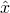
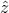
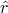
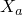
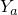
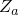

# *NMAP

### *NMAPMap nodes from one coordinate system to another and rotate, translate, or scale the nodal coordinates.

Map nodes from one coordinate system to another and rotate, translate, or scale the nodal coordinates.

**Products: **Abaqus/Standard  Abaqus/Explicit  Abaqus/CFD  Abaqus/CAE  

**Type: **Model data  

**Level: **This option is not supported in a model defined in terms of an assembly of part instances.

**Abaqus/CAE: **Unsupported; meshing techniques in the Mesh module are usually preferable.

##### **Reference:**

- ["Node definition," Section 2.1.1 of the Abaqus Analysis User's Guide](../usb/usb-link.md#usb-int-inode)

### **Required parameters: **

NSET

Set this parameter equal to the name of the node set containing the nodes to be mapped. The nodes that are mapped are those that belong to this set at the time this option is encountered.

TYPE

Set TYPE=ROTATION to introduce a rotation of a specified angle about a given axis defined by two points *a* and *b* (or by the coordinates of these points). The origin of rotation is given by a third point *c* (or by the coordinates of this point).

Set TYPE=TRANSLATION to introduce a translation along a given axis defined by two nodes *a* and *b* (or by the coordinates of these points). 

Set TYPE=SCALE to scale each axis with respect to one node *a* (or by the coordinates of this point). 

Set TYPE=RECTANGULAR to introduce a simple shift or rotation. Point *a* in [Figure 14.4--1](ch14abk04.md#knmap-coordsys) defines the origin of the local rectangular coordinate system defining the map. The local -axis is defined by the line joining points *a* and *b*. The local – plane is defined by the plane passing through points *a*, *b*, and *c*.

Set TYPE=CYLINDRICAL to map from cylindrical coordinates. Point *a* in [Figure 14.4--1](ch14abk04.md#knmap-coordsys) defines the origin of the local cylindrical coordinate system defining the map. The line going through point *a* and point *b* defines the -axis of the local cylindrical coordinate system. The local – plane for  is defined by the plane passing through points *a*, *b*, and *c*.

Set TYPE=DIAMOND to map from skewed Cartesian coordinates. Point *a* in [Figure 14.4--1](ch14abk04.md#knmap-coordsys) defines the origin of the local diamond coordinate system defining the map. The line going through point *a* and point *b* defines the -axis of the local coordinate system. The line going through point *a* and point *c* defines the -axis of the local coordinate system. The line going through point *a* and point *d* defines the -axis of the local coordinate system. 

Set TYPE=SPHERICAL to map from spherical coordinates. Point *a* in [Figure 14.4--1](ch14abk04.md#knmap-coordsys) defines the origin of the local spherical coordinate system defining the map. The line going through point *a* and point *b* defines the polar axis of the local spherical coordinate system. The plane passing through point *a* and perpendicular to the polar axis defines the  plane. The plane passing through points *a*, *b*, and *c* defines the local  plane.

Set TYPE=TOROIDAL to map from toroidal coordinates. Point *a* in [Figure 14.4--1](ch14abk04.md#knmap-coordsys) defines the origin of the local toroidal coordinate system defining the map. The axis of the local toroidal system lies in the plane defined by points *a*, *b*, and *c*. The *R*-coordinate of the toroidal system is defined by the distance between points *a* and *b*. The line between points *a* and *b* defines the  position. For every value of  the -coordinate is defined in a plane perpendicular to the plane defined by the points *a*, *b*, and *c* and perpendicular to the axis of the toroidal system.  lies in the plane defined by the points by *a*, *b*, and *c*.

Set TYPE=BLENDED to map via blended quadratics in an Abaqus/Standard analysis. 

### **Optional parameter: **

DEFINITION

Set DEFINITION =COORDINATES (default) to define the local system, the axis of rotation, the origin of rotation, or the axis of translation by giving the coordinates of the points *a*, *b*, *c*, and *d* whichever appropriate for the chosen type.

Set DEFINITION=NODES to define the local system, the axis of rotation, the origin of rotation, or the axis of translation by giving global node numbers for points *a*, *b*, *c*, and *d* depending on the type. This option cannot be used with TYPE=BLENDED.

### **Data lines for TYPE=ROTATION, DEFINITION=COORDINATES: **

**First line:**

**Second line:**

**Third line:**

### **Data lines for TYPE=ROTATION, DEFINITION=NODES: **

**First line:**

**Second line:**

**Third line:**

### **Data lines for TYPE=TRANSLATION, DEFINITION=COORDINATES: **

**First line:**

**Second line:**

### **Data lines for TYPE=TRANSLATION, DEFINITION=NODES: **

**First line:**

**Second line:**

### **Data lines for TYPE=SCALE, DEFINITION=COORDINATES: **

**First line:**

**Second line:**

### **Data lines for TYPE=SCALE, DEFINITION=NODES: **

**First line:**

**Second line:**

### **Data lines for TYPE=RECTANGULAR, CYLINDRICAL, DIAMOND, SPHERICAL, or TOROIDAL with DEFINITION=COORDINATES: **

**First line:**

**Second line:**

If TYPE=RECTANGULAR is specified and only point *a* is given, the coordinates of the nodes in the set are simply shifted by , , and .

**Third line:**

### **Data lines for TYPE=RECTANGULAR, CYLINDRICAL, DIAMOND, SPHERICAL, or TOROIDAL with DEFINITION=NODES: **

**First line:**

**Second line:**

If TYPE=RECTANGULAR is specified and only point *a* is given, the coordinates of the nodes in the set are simply shifted by , , and .

**Third line:**

### **Data lines for TYPE=BLENDED: **

**First line:**

**Second line:**

Continue, giving up to 20 control nodes, but giving at least the eight corner nodes. If an edge of the blended mapping is to be mapped linearly, the corresponding mid-edge control node can be omitted from the list. This is done by inserting a line with node number 0 only (a blank line) in place of the definition of the control node and its mapped coordinates. The control nodes do not have to be nodes in the finite element model—they can be nodes used just for mesh generation. Abaqus eliminates any nodes that are not used in the analysis model before doing the analysis.

**Figure 14.4–1** Coordinate systems; angles are in degrees.

