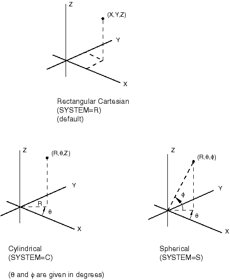

# *PARAMETER SHAPE VARIATION

### *PARAMETER SHAPE VARIATIONDefine parametric shape variations.

This option is used to define parametric shape variations.

**Products: **Abaqus/Standard  Abaqus/Explicit  

**Type: **Model data  

**Level: **Part,  Part instance  

##### **References:**

- ["Parametric shape variation," Section 2.1.2 of the Abaqus Analysis User's Guide](../usb/usb-link.md#usb-int-iparshapevar)
- ["Design sensitivity analysis," Section 19.1.1 of the Abaqus Analysis User's Guide](../usb/usb-link.md#usb-anl-adsa)

### **Required parameter: **

PARAMETER

Set this keyword parameter equal to the name of the parameter to which the shape variation data refer. If this parameter is also a design parameter, the shape variations are used to define the design gradients of the nodal coordinates for design sensitivity analysis.

### **Optional parameters (mutually exclusive---if neither parameter is specified, Abaqus assumes that the shape variation data will be entered directly on the data lines): **

FILE

Set this parameter equal to the name of the results file from a previous Abaqus/Standard analysis containing either the mode shapes from a [*BUCKLE](ch02abk16.md) or [*FREQUENCY](ch06abk35.md) analysis or the nodal displacements from a [*STATIC](ch18abk31.md) analysis. This option cannot be used for models defined in terms of an assembly of part instances.

INPUT

Set this parameter equal to the name of the alternate input file containing the shape variation data. See ["Input syntax rules," Section 1.2.1 of the Abaqus Analysis User's Guide](../usb/usb-link.md#usb-int-iinputsyntax), for the syntax of such file names.

### **Required parameter if the FILE parameter is used: **

STEP

Set this parameter equal to the step number (in the analysis whose results file is being used as input to this option) from which the modal or displacement data are to be read.

### **Optional parameters if the FILE parameter is used: **

INC

Set this parameter equal to the increment number (in the analysis whose results file is being used as input to this option) from which the displacement data are to be read. If this parameter is omitted, Abaqus will read the data from the last increment available for the specified step on the results file.

MODE

Set this parameter equal to the mode number (in the analysis whose results file is being used as input to this option) from which the modal data are to be read. If this parameter is omitted, Abaqus will read the data from the first mode available for the specified step on the results file.

NSET

Set this parameter equal to the node set to which the shape variation values are to be applied. If this parameter is omitted, the shape variation will be applied to all nodes in the model.

### **Optional parameter if the FILE parameter is omitted: **

SYSTEM

Set SYSTEM=R (default) to specify the shape variation as values of Cartesian coordinates. Set SYSTEM=C to specify the shape variation as values of cylindrical coordinates. Set SYSTEM=S to specify the shape variation as values of spherical coordinates. See [Figure 16.3--1](ch16abk03.md#kimperfection).

The SYSTEM parameter is entirely local to this option and should not be confused with the [*SYSTEM](ch18abk59.md) option. As the data lines are read, the shape variation values specified are transformed to the global rectangular Cartesian coordinate system. This transformation requires that the object be centered about the origin of the global coordinate system; i.e., the [*SYSTEM](ch18abk59.md) option should be off when specifying shape variations as values using either cylindrical or spherical coordinates. The details of how the shape variation is computed in particular coordinate systems are given in ["Parametric shape variation," Section 2.1.2 of the Abaqus Analysis User's Guide](../usb/usb-link.md#usb-int-iparshapevar).

### **Data lines to define the shape variation if the FILE and INPUT parameters are omitted: **

**First line:**

Repeat this data line as often as necessary to define the shape variation. The data given on this data line cannot be parameterized.

**Figure 16.3–1** Coordinate systems.

