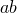
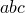

# *PERIODIC

### *PERIODICDefine periodic symmetry for a cavity radiation heat transfer analysis.

This option is used to define cavity symmetry by periodic repetition in a given direction. It can be used only following the [*RADIATION SYMMETRY](ch17abk05.md) option.

**Products: **Abaqus/Standard  Abaqus/CAE  

**Type: **History data 

**Level: **Step

**Abaqus/CAE: **Interaction module

##### **References:**

- ["Cavity radiation," Section 41.1.1 of the Abaqus Analysis User's Guide](../usb/usb-link.md#usb-cni-acavityradiation)
- [*RADIATION SYMMETRY](ch17abk05.md)

### **Required parameter: **

TYPE

Set TYPE=2D to create a cavity composed of the cavity surface defined in the model and a series of similar images generated by its repetition according to a two-dimensional distance vector. The repeated images are bounded by lines parallel to line  (see [Figure 16.5--1](ch16abk05.md#kperiodic-2d)). The distance vector must be defined so that it points away from line  and into the domain of the model. This option can be used only for two-dimensional cases.

Set TYPE=3D to create a cavity composed of the cavity surface defined in the model and a series of similar images generated by its repetition according to a three-dimensional distance vector. The repeated images are bounded by planes parallel to plane  (see [Figure 16.5--2](ch16abk05.md#kperiodic-3d)). The distance vector must be defined so that it points away from plane  and into the domain of the model. This option can be used only for three-dimensional cases.

Set TYPE=ZDIR to create a cavity composed of the cavity surface defined in the model and a series of similar images generated by its repetition in the *z*-direction. The repeated images are bounded by lines of constant *z*-coordinate (see [Figure 16.5--3](ch16abk05.md#kperiodic-zdir)). The *z*-distance vector must be defined so that it points away from the *z*-constant periodic symmetry reference line and into the domain of the model. This option can be used only for axisymmetric cases.

### **Optional parameter: **

NR

Set this parameter equal to the number of repetitions used in the numerical calculation of the cavity view factors resulting from the periodic symmetry. The result of this symmetry is a cavity composed of the cavity surface defined in the model plus twice NR similar images, since the periodic symmetry is assumed to apply both in the positive and negative directions of the distance vector. The default value is NR=2. 

### **Data line to define periodic symmetry of a two-dimensional cavity (TYPE=2D): **

**First (and only) line:**

### **Data lines to define periodic symmetry of a three-dimensional cavity (TYPE=3D): **

**First line:**

**Second line:**

### **Data line to define periodic symmetry of an axisymmetric cavity (TYPE=ZDIR): **

**First (and only) line:**

**Figure 16.5–1** [*PERIODIC](ch16abk05.md), TYPE=2D option.

**Figure 16.5–2** [*PERIODIC](ch16abk05.md), TYPE=3D option.

**Figure 16.5–3** [*PERIODIC](ch16abk05.md), TYPE=ZDIR option.

