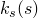
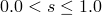

# *PERMEABILITY

### *PERMEABILITYDefine permeability for pore fluid flow.

This option is used to define permeability for pore fluid flow in problems involving seepage and porous media.

**Products: **Abaqus/Standard  Abaqus/CFD  Abaqus/CAE  

**Type: **Model data  

**Level: **Model  

**Abaqus/CAE: **Property module

##### **Reference:**

- ["Permeability," Section 26.6.2 of the Abaqus Analysis User's Guide](../usb/usb-link.md#usb-mat-cpermeabil)

### Defining permeability in Abaqus/Standard analyses

### **Optional parameters: **

DEPENDENCIES

Set this parameter equal to the number of field variable dependencies included in the definition of the permeability. If this parameter is omitted, it is assumed that the permeability is independent of field variables. 

This parameter can be used only in conjunction with TYPE=ISOTROPIC, ORTHOTROPIC, or ANISOTROPIC.

TYPE

Set TYPE=ISOTROPIC (default) to define fully saturated isotropic permeability. Set TYPE=ORTHOTROPIC to define fully saturated orthotropic permeability. Set TYPE=ANISOTROPIC to define fully saturated anisotropic permeability.

 Set TYPE=SATURATION to define ; this must be a repeated use of the option for the same material and must follow the definition of fully saturated permeability. The definition must give  for , with  at .

 Set TYPE=VELOCITY to define ; this must be a repeated use of the option for the same material and must follow the definition of fully saturated permeability.

### **Required parameter when fully saturated material properties are defined: **

SPECIFIC

Set this parameter equal to the specific weight of the wetting liquid,  (units of [FL3](../popups/usb-int-iconventions-unitsym.md)). The actual specific weight must be given as a nonzero positive value, and the GRAV distributed load type must be used to apply the gravitational loading if a total pressure solution is required (see ["Coupled pore fluid diffusion and stress analysis," Section 6.8.1 of the Abaqus Analysis User's Guide](../usb/usb-link.md#usb-anl-acoupdiffstress), for a discussion of total and excess pressure solutions).

### **Data lines to define fully saturated isotropic permeability (TYPE=ISOTROPIC): **

**First line:**

**Subsequent lines (only needed if the DEPENDENCIES parameter has a value greater than five):**

Repeat this set of data lines as often as necessary to define the variation.

### **Data lines to define fully saturated orthotropic permeability (TYPE=ORTHOTROPIC): **

**First line:**

**Subsequent lines (only needed if the DEPENDENCIES parameter has a value greater than three):**

Repeat this set of data lines as often as necessary to define the variation.

### **Data lines to define fully saturated anisotropic permeability (TYPE=ANISOTROPIC): **

**First line:**

**Subsequent lines (only needed if the DEPENDENCIES parameter is specified):**

Repeat this set of data lines as often as necessary to define the variation.

### **Data lines to define the dependence of permeability on saturation of the wetting liquid, *ks(s)* (TYPE=SATURATION): **

**First line:**

Repeat this data line as often as necessary to define the variation. The table must provide  at .

### **Data lines to define the velocity coefficient (TYPE=VELOCITY): **

**First line:**

Repeat this data line as often as necessary to define the variation.

### Defining permeability in Abaqus/CFD analyses

### **Optional parameters: **

INERTIAL DRAG COEFFICIENT

Set this parameter proportional to the value of the inertial (quadratic or form) drag in the porous medium. The default value is 0.142887.

TYPE

Set TYPE=ISOTROPIC (default) to define fully saturated isotropic permeability. 

 Set TYPE=CARMAN KOZENY to define permeability as a function of porosity through the Carman-Kozeny relation.

### **Data lines to define fully saturated isotropic permeability (TYPE=ISOTROPIC): **

**First line:**

Repeat this data line as often as necessary to define the variation.

### **Data line to define the Carman-Kozeny permeability relation (TYPE=CARMAN KOZENY): **

**First (and only) line:**

