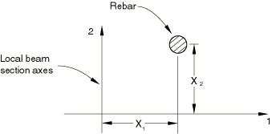
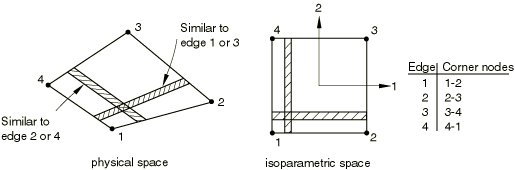
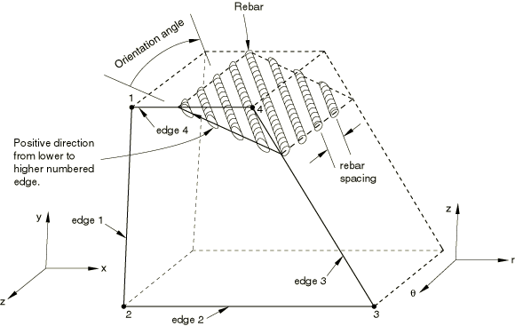
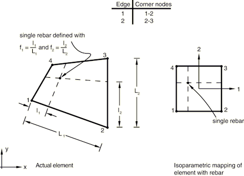

# *REBAR

### *REBARDefine rebar as an element property.

This option is used as an alternative method to define rebar as an element property in shells, membranes, and solid (continuum) elements. It must be used to define rebar in beams in Abaqus/Standard analyses. The preferred option for defining rebar in shells, membranes, and surface elements is the [*REBAR LAYER](ch17abk12.md) option, which must be used in conjunction with the [*SHELL SECTION](ch18abk15.md), the [*MEMBRANE SECTION](ch13abk16.md), or the [*SURFACE SECTION](ch18abk54.md) options. The preferred method for defining rebar in solids is to embed reinforced surface or membrane elements in “host” solid elements using the [*EMBEDDED ELEMENT](ch05abk14.md) option. 

**Products: **Abaqus/Standard  Abaqus/Explicit  

**Type: **Model data  

**Level: **Part,  Part instance  

##### **References:**

- ["Defining rebar as an element property," Section 2.2.4 of the Abaqus Analysis User's Guide](../usb/usb-link.md#usb-int-erebar)
- ["Defining reinforcement," Section 2.2.3 of the Abaqus Analysis User's Guide](../usb/usb-link.md#usb-int-erebarlayer)

### **Required parameters: **

ELEMENT

Set ELEMENT=BEAM to define rebar in beam elements in an Abaqus/Standard analysis.

Set ELEMENT=SHELL to define rebar in three-dimensional shell elements. Rebar cannot be used with triangular shell elements.

Set ELEMENT=AXISHELL to define rebar in axisymmetric shell elements.

Set ELEMENT=MEMBRANE to define rebar in three-dimensional membrane elements. Rebar cannot be used with triangular membrane elements.

Set ELEMENT=AXIMEMBRANE to define rebar in axisymmetric membrane elements in an Abaqus/Standard analysis.

Set ELEMENT=CONTINUUM to define rebar in continuum (solid) elements. Rebar cannot be used with any plane triangular, triangular prism, tetrahedral, or infinite elements.

MATERIAL

Set this parameter equal to the name of the material of which these rebar are made.

NAME

Set this parameter equal to a label that will be used to refer to this rebar set. This label can be used in defining rebar prestress and output requests. Each layer of rebar must be assigned a separate name in a particular element or element set.

### **Optional parameters: **

GEOMETRY

This parameter is not meaningful for rebar in beams, axisymmetric shells, or axisymmetric membranes, or for single rebar in continuum elements.

Set GEOMETRY=ISOPARAMETRIC (default) to indicate that the layer of rebar is parallel to a direction of the element local (isoparametric) coordinate system.

Set GEOMETRY=SKEW to indicate that the rebar layer is in a skew direction with respect to the element faces.

ISODIRECTION

Set this parameter equal to the isoparametric direction from which the rebar angle output will be measured. The default is 1.

ORIENTATION

This parameter is meaningful only for skew rebar in shell and membrane elements. Set this parameter equal to the name of an orientation definition that defines the angular orientation of the rebar. This parameter is not permitted with axisymmetric shell and axisymmetric membrane elements.

SINGLE

This parameter is meaningful only for continuum elements. Include this parameter if a single rebar is being defined by each data line. If this parameter is omitted, each line defines a layer of uniformly spaced rebar in the element isoparametric space.

### **Data lines to define rebar in beam elements: **

**First line:**

Repeat this data line as often as necessary. Each line defines a single rebar.

**Figure 17.11–1** Rebar location in a beam section.

### **Data lines to define isoparametric rebar in three-dimensional shell elements: **

**First line:**

Repeat this data line as often as necessary. Each line defines a layer of rebar.

### **Data lines to define isoparametric rebar in three-dimensional membrane elements: **

**First line:**

Repeat this data line as often as necessary. Each line defines a layer of rebar.

**Figure 17.11–2** “Isoparametric” rebar in a three-dimensional shell or membrane.

### **Data lines to define skew rebar in three-dimensional shell elements: **

**First line:**

Repeat this data line as often as necessary. Each line defines a layer of rebar.

### **Data lines to define skew rebar in three-dimensional membrane elements: **

**First line:**

Repeat this data line as often as necessary. Each line defines a layer of rebar.

### **Data lines to define rebar in axisymmetric shell elements: **

**First line:**

Repeat this data line as often as necessary. Each line defines a layer of rebar.

### **Data lines to define rebar in axisymmetric membrane elements: **

**First line:**

Repeat this data line as often as necessary. Each line defines a layer of rebar.

### **Data lines to define a layer of uniformly spaced rebar in continuum elements (SINGLE parameter omitted) when the layer is parallel to two isoparametric directions in the element's local (isoparametric) coordinate system (GEOMETRY=ISOPARAMETRIC): **

**First line:**

Repeat this data line as often as necessary. Each line defines a layer of rebar.

### **Data lines to define a layer of uniformly spaced rebar in continuum elements (SINGLE parameter omitted) when the layer is parallel to only one isoparametric direction in the element's local (isoparametric) coordinate system (GEOMETRY=SKEW): **

**First line:**

**Second line:**

Only the two values corresponding to the two edges that the rebar intersects can be nonzero.

Repeat the first and second data lines as often as necessary. Each pair of lines defines a layer of rebar.

### **Data lines to define a single rebar in continuum elements (SINGLE parameter included): **

**First line:**

In three-dimensional cases the fractional distances , and  are given along the first two edges of the face identified in [Figure 17.11--7](ch17abk11.md#krebar-3d-solid) for the isoparametric direction chosen.

Repeat this data line as often as necessary. Each line defines a single rebar.

**Figure 17.11–3** Orientation of rebar in plane and axisymmetric solid elements.

**Figure 17.11–4** Rebar layer definition in solid elements with GEOMETRY=ISOPARAMETRIC.

**Figure 17.11–5** Rebar layer definition in solid elements with GEOMETRY=SKEW.

**Figure 17.11–6** SINGLE rebar in a solid element.

**Figure 17.11–7** Isoparametric direction and edge definitions for three-dimensional elements.

