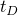

# *RESPONSE SPECTRUM

### *RESPONSE SPECTRUMCalculate the response based on user-supplied response spectra.

This option is used to calculate estimates of peak values of nodal and element responses based on user-supplied response spectra (defined using the [*SPECTRUM](ch18abk28.md) option) and on the natural modes of the system.

**Products: **Abaqus/Standard  Abaqus/CAE  

**Type: **History data 

**Level: **Step

**Abaqus/CAE: **Step module

##### **References:**

- ["Response spectrum analysis," Section 6.3.10 of the Abaqus Analysis User's Guide](../usb/usb-link.md#usb-anl-aresponsespectrum)
- [*SPECTRUM](ch18abk28.md)

### **Optional parameters: **

COMP

Set COMP=ALGEBRAIC to sum the directional excitation components algebraically. If this parameter is used, the directional excitation components are summed first, followed by the modal summation.

Set COMP=SRSS (default) to use the square root of the sum of the squares. If this parameter is used, the modal summation is performed first, followed by the summation of the directional excitation components.

Set COMP=R40 to use the 40% rule as recommended by the ASCE 4–98 Guide that assumes that for the maximum response from one component, the responses from the other two components are 40% of their maximum value.

Set COMP=R30 to use the 30% rule. This rule assumes that for the maximum response from one component, the responses from the other two components are 30% of their maximum value. It follows the expressions for the 40% rule as described in the ASCE 4–98 Guide.

SUM

Set SUM=ABS (default) to sum the absolute values of the responses in each natural mode.

Set SUM=CQC to use the complete quadratic combination method to sum the responses in each natural mode.

Set SUM=DSC to use the double sum combination. This method is the first attempt to evaluate modal correlation based on random vibration theory. It utilizes the time duration  of strong earthquake motion. 

Set SUM=GRP to use the grouping method as described in USNRC Regulatory Guide 1.92, February 1976.

Set SUM=NRL to use the Naval Research Laboratory method. 

Set SUM=SRSS to use the square root of the sum of squares summation.

Set SUM=TENP to use the Ten Percent Method.

### **Data lines for a response spectrum analysis: **

**First line:**

**Second line (optional):**

**Third line (optional):**

