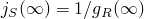
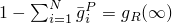

# *SHEAR TEST DATA

### *SHEAR TEST DATAUsed to provide shear test data.

This option can be used only in conjunction with the [*VISCOELASTIC](ch21abk04.md) option. The [*SHEAR TEST DATA](ch18abk13.md) option cannot be used for a viscoelastic material if the [*COMBINED TEST DATA](ch03abk25.md) option is used.

**Products: **Abaqus/Standard  Abaqus/Explicit  Abaqus/CAE  

**Type: **Model data  

**Level: **Model  

**Abaqus/CAE: **Property module

##### **References:**

- ["Time domain viscoelasticity," Section 22.7.1 of the Abaqus Analysis User's Guide](../usb/usb-link.md#usb-mat-ctimevisco)
- [*VISCOELASTIC](ch21abk04.md)

### Using shear test data to define a viscoelastic material

### **Optional parameter: **

SHRINF

To specify creep test data, set this parameter equal to the value of the long-term, normalized shear compliance .

To specify relaxation test data, set this parameter equal to the value of the long-term, normalized shear modulus . The shear compliance and shear modulus are related by . The fitting procedure will use the specified value in the constraint .

### **Data lines to specify creep test data: **

**First line:**

Repeat this data line as often as necessary to give the compliance-time data.

### **Data lines to specify relaxation test data: **

**First line:**

Repeat this data line as often as necessary to give the modulus-time data.

