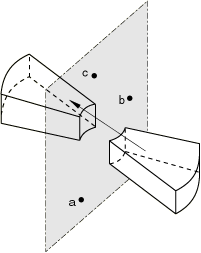

# *SUBSTRUCTURE PROPERTY

### *SUBSTRUCTURE PROPERTYTranslate, rotate, and/or reflect substructures.

This option is used to define properties for a substructure. It is required for all substructures in a model.

**Product: **Abaqus/Standard  

**Type: **Model data  

**Level: **This option is not supported in a model defined in terms of an assembly of part instances.

##### **Reference:**

- ["Using substructures," Section 10.1.1 of the Abaqus Analysis User's Guide](../usb/usb-link.md#usb-anl-asuperelements)

### **Required parameter: **

ELSET

Set this parameter equal to the name of the element set containing the substructures for which properties are being defined.

### **Optional parameter: **

POSITION TOL

Set this parameter equal to the tolerance on the distance between usage level nodes and the corresponding substructure nodes. If this parameter is omitted, the default is a tolerance of 104 times the largest overall dimension within the substructure. If the parameter is given with a value of 0.0, the position of the retained nodes is not checked.

### **Data line to translate a substructure: **

**First (and only) line:**

### **Data lines to translate and/or rotate a substructure: **

**First line:**

Enter values of zero to apply a pure rotation.

**Second line:**

### **Data lines to translate and/or reflect a substructure: **

**First line:**

Enter values of zero to apply a pure reflection.

**Second line:**

**Third line:**

**Fourth line:**

### **Data lines to translate, rotate, and reflect a substructure: **

**First line:**

**Second line:**

**Third line:**

**Fourth line:**

**Figure 18.46–1** Substructure rotation.

**Figure 18.46–2** Substructure reflection. Points *a*, *b*, and *c* cannot be colinear.

