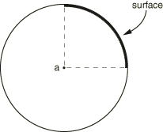
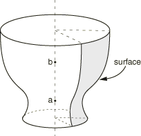
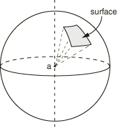
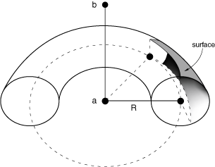

# *SURFACE PROPERTY ASSIGNMENT

### *SURFACE PROPERTY ASSIGNMENTAssign surface properties to a surface for the general contact algorithm.

This option is used to modify surface properties for surfaces that are involved in general contact interactions. It must be used in conjunction with the [*CONTACT](ch03abk54.md) option.

**Products: **Abaqus/Standard  Abaqus/Explicit  Abaqus/CAE  

**Type: **Model data in Abaqus/Standard; Model or history data in Abaqus/Explicit  

**Level: **Model in Abaqus/Standard; Model or Step in Abaqus/Explicit  

**Abaqus/CAE: **Interaction module

##### **References:**

- ["Surface properties for general contact in Abaqus/Standard," Section 36.2.2 of the Abaqus Analysis User's Guide](../usb/usb-link.md#usb-cni-asurfacepropassignstd)
- ["Assigning surface properties for general contact in Abaqus/Explicit," Section 36.4.2 of the Abaqus Analysis User's Guide](../usb/usb-link.md#usb-cni-asurfacepropassign)
- [*CONTACT](ch03abk54.md)

### **Required parameter: **

PROPERTY

Use this parameter to specify the property type being assigned. To modify more than one type of surface property, include the [*SURFACE PROPERTY ASSIGNMENT](ch18abk53.md) option more than once with different values for this parameter.

Set PROPERTY=BEAM SMOOTHING to control smoothing of beam segments in beam-to-beam contact. This parameter value applies only to Abaqus/Standard analyses.

Set PROPERTY=FEATURE EDGE CRITERIA to control which primary feature edges and secondary feature edges should be activated in the general contact domain.

Set PROPERTY=GEOMETRIC CORRECTION to assign geometric corrections. 

Set PROPERTY=OFFSET FRACTION to assign the surface offset as a fraction of the surface thickness.

Set PROPERTY=THICKNESS to assign the surface thickness.

### **Data lines for PROPERTY=BEAM SMOOTHING: **

**First line:**

Repeat this data line as often as necessary. If the beam smoothing assignments overlap, the last assignment applies in the overlap region.

### **Data lines for PROPERTY=FEATURE EDGE CRITERIA in Abaqus/Standard: **

**First line:**

Repeat this data line as often as necessary. If the feature edge criteria assignments overlap, the last assignment applies in the overlap region.

### **Data lines for PROPERTY=FEATURE EDGE CRITERIA in Abaqus/Explicit: **

**First line:**

Repeat this data line as often as necessary. If the feature edge criteria assignments overlap, the last assignment applies in the overlap region.

### **Data lines for PROPERTY=GEOMETRIC CORRECTION to define smoothing on regions of two-dimensional surfaces that correspond (or nearly correspond) to a circular arc: **

**First line:**

Repeat this data line as often as necessary. If the geometry correction assignments overlap, the last assignment applies in the overlap region.

**Figure 18.53–1** Two-dimensional circumferential smoothing.

### **Data lines for PROPERTY=GEOMETRIC CORRECTION to define smoothing on regions of surfaces that correspond (or nearly correspond) to a surface of revolution: **

**First line:**

Repeat this data line as often as necessary. If the geometry correction assignments overlap, the last assignment applies in the overlap region.

**Figure 18.53–2** Three-dimensional circumferential smoothing.

### **Data lines for PROPERTY=GEOMETRIC CORRECTION to define smoothing on regions of surfaces that correspond (or nearly correspond) to a spherical section: **

**First line:**

Repeat this data line as often as necessary. If the geometry correction assignments overlap, the last assignment applies in the overlap region.

**Figure 18.53–3** Spherical smoothing.

### **Data lines for PROPERTY=GEOMETRIC CORRECTION to define smoothing on regions of surfaces that correspond (or nearly correspond) to a circular arc revolved about an axis: **

**First line:**

Repeat this data line as often as necessary. If the geometry correction assignments overlap, the last assignment applies in the overlap region.  The line joining point *a* and the center of the circular arc should be perpendicular to the axis of revolution.

**Figure 18.53–4** Three-dimensional toroidal smoothing.

### **Data lines for PROPERTY=GEOMETRIC CORRECTION to define surface regions that should not be smoothed (corresponds to default): **

**First line:**

Repeat this data line as often as necessary. If the geometry correction assignments overlap, the last assignment applies in the overlap region.

### **Data lines for PROPERTY=OFFSET FRACTION: **

**First line:**

Repeat this data line as often as necessary. If the offset fraction assignments overlap, the last assignment applies in the overlap region.

### **Data lines for PROPERTY=THICKNESS: **

**First line:**

Repeat this data line as often as necessary. If the thickness assignments overlap, the last assignment applies in the overlap region.

