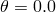

# *SYMMETRIC MODEL GENERATION

### *SYMMETRIC MODEL GENERATIONCreate a three-dimensional model from an axisymmetric or partial three-dimensional model.

This option is used to create a three-dimensional model by revolving the cross-section of an axisymmetric model about a symmetry axis,  by revolving a single three-dimensional sector about the symmetry axis, or by combining two parts of a symmetric three-dimensional model where one part is the original model and the other part is obtained by reflecting the original part through a line or a plane.

**Product: **Abaqus/Standard  

**Type: **Model data  

**Level: **This option is not supported in a model defined in terms of an assembly of part instances.

##### **Reference:**

- ["Symmetric model generation," Section 10.4.1 of the Abaqus Analysis User's Guide](../usb/usb-link.md#usb-anl-aaximodelgen)

### **Required, mutually exclusive parameters: **

PERIODIC

Use this parameter to indicate that a periodic three-dimensional model must be generated by revolving a single three-dimensional sector of the model about the symmetry axis (see [Figure 18.57--1](ch18abk57.md#ksymm-model-gen-per)). 

Set PERIODIC=CONSTANT (default) to indicate that each generated sector in the periodic model has a constant angle. 

Set PERIODIC=VARIABLE to indicate that each generated sector in the periodic model can have a variable angle in the circumferential direction.

In both cases each sector always has the same geometry and mesh. The surfaces on both sides of the original sector must be completely planar when PERIODIC=VARIABLE. If the surface meshes on either side of the original sector are not matched completely, constraints between the neighboring pairs of corresponding surfaces specified on the data lines will be applied with an automatically generated [*TIE](ch19abk06.md) option when the periodic three-dimensional model is generated.

REFLECT

Set REFLECT=LINE to indicate that a three-dimensional model must be generated by reflecting a partial three-dimensional model through a symmetry line ([Figure 18.57--3](ch18abk57.md#ksymm-model-gen-refl-line)). 

Set REFLECT=PLANE to indicate that a three-dimensional model must be generated by reflecting a partial three-dimensional model through a symmetry plane ([Figure 18.57--4](ch18abk57.md#ksymm-model-gen-refl-plane)).

REVOLVE

Include this parameter to indicate that a three-dimensional model must be generated by revolving the cross-section of an axisymmetric mesh about the symmetry axis. See [Figure 18.57--2](ch18abk57.md#ksymm-model-gen-revolve).

### **Optional parameters: **

ELEMENT OFFSET

Set this parameter equal to an integer to define the offset for element numbering. When the REVOLVE parameter is used, the offset is added to each element number on the previous cross-section to obtain the numbering of the elements on the next cross-section, starting at the reference cross-section, . The reference cross-section uses the same numbering as the original axisymmetric model. When the REFLECT parameter is used, the offset is added to the original element numbers to define the numbering on the reflected part. The default and minimum value is the largest element number used in the original model.

FILE NAME

Set this parameter equal to the name of an external file (without an extension) to which keyword and data lines for the model definition will be written. The extension `.axi` will be added to the file name provided by the user. See ["Input syntax rules," Section 1.2.1 of the Abaqus Analysis User's Guide](../usb/usb-link.md#usb-int-iinputsyntax), for the syntax of such file names.

NODE OFFSET

Set this parameter equal to an integer to define the offset used for node numbering. When the REVOLVE parameter is used, the offset is added to each node number on the previous cross-section to obtain the numbering of the nodes on the next cross-section, starting at the reference cross-section, . The reference cross-section uses the same numbering as the original axisymmetric model. When the REFLECT parameter is used, the offset is added to the original node numbers to define the numbering on the reflected part. The default and minimum value is the largest node number used in the original model.

TOLERANCE

Set this parameter equal to the distance to be used in the search for duplicate nodes. Duplicate nodes on the axis of revolution of a revolved model, on the connection planes between sectors of a periodic model, and on the connection plane between the two parts of a reflected model will be eliminated. The default distance is 1.0% of the average element dimension.

### **Data lines if each generated sector in the periodic model has a constant angle (PERIODIC=CONSTANT): **

**First line:**

**Second line:**

**Third line (needed if the surface meshes on either side of the original sector are not matched completely):**

Repeat the third data line as often as necessary to define pairs of corresponding surfaces on each side of the original repetitive sector. Constraints between the neighboring pairs of corresponding surfaces will be applied with an automatically generated [*TIE](ch19abk06.md) option when the periodic three-dimensional model is generated.

### **Data lines if each generated sector in the periodic model has a variable angle (PERIODIC=VARIABLE): **

**First line:**

**Second line:**

**Third line:**

Repeat the third data line as often as necessary to define all the sectors of the model in the circumferential direction.

**Subsequent lines (needed if the surface meshes on either side of the original sector are not matched completely):**

Repeat the subsequent data line as often as necessary to define more pairs of corresponding surfaces on each side of the original sector. Constraints between the neighboring pairs of corresponding surfaces will be applied with the automatically generated [*TIE](ch19abk06.md) option when the periodic three-dimensional model is generated.

### **Data line if REFLECT=LINE: **

**First (and only) line:**

### **Data lines if REFLECT=PLANE: **

**First line:**

**Second line:**

### **Data lines if the REVOLVE parameter is included: **

**First line:**

**Second line:**

**Third line:**

Repeat the third data line as often as necessary to define the discretization of the model in the circumferential direction.

**Figure 18.57–1** Revolving a single three-dimensional repetitive sector to create a periodic structure.

**Figure 18.57–2** Revolving an axisymmetric cross-section.

**Figure 18.57–3** Reflecting a three-dimensional model through line *ab* with node offset *n*.

**Figure 18.57–4** Reflecting a three-dimensional model through a plane *abc* with node offset *n*.

