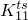
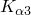

# *TRANSVERSE SHEAR STIFFNESS

### *TRANSVERSE SHEAR STIFFNESSDefine transverse shear stiffness for beams and shells.

This option must be used in conjunction with the [*BEAM GENERAL SECTION](ch02abk05.md) option, the [*BEAM SECTION](ch02abk06.md) option, the [*COHESIVE SECTION](ch03abk24.md) option, the [*SHELL GENERAL SECTION](ch18abk14.md) option, or the [*SHELL SECTION](ch18abk15.md) option. The transverse shear stiffness defined with this option affects only the transverse shear flexible elements whose section properties are defined by the immediately preceding section option.

**Products: **Abaqus/Standard  Abaqus/Explicit  Abaqus/CAE  

**Type: **Model data  

**Level: **Part,  Part instance  

**Abaqus/CAE: **Property module

##### **References:**

- ["Shell section behavior," Section 29.6.4 of the Abaqus Analysis User's Guide](../usb/usb-link.md#usb-elm-eshellsectionbehavior)
- ["Choosing a beam element," Section 29.3.3 of the Abaqus Analysis User's Guide](../usb/usb-link.md#usb-elm-ebeamelem)
- ["Defining the constitutive response of cohesive elements using a continuum approach," Section 32.5.5 of the Abaqus Analysis User's Guide](../usb/usb-link.md#usb-elm-ecohesivematbehavior)
- ["Defining the constitutive response of cohesive elements using a traction-separation description," Section 32.5.6 of the Abaqus Analysis User's Guide](../usb/usb-link.md#usb-elm-ecohesivebehavior)
- [*SHELL GENERAL SECTION](ch18abk14.md)
- [*SHELL SECTION](ch18abk15.md)
- [*BEAM GENERAL SECTION](ch02abk05.md)
- [*BEAM SECTION](ch02abk06.md)
- [*COHESIVE SECTION](ch03abk24.md)

**There are no parameters associated with this option.**

### **Data line when used with cohesive sections, shell sections, and [*BEAM GENERAL SECTION](ch02abk05.md), SECTION=MESHED: **

**First (and only) line:**

If either value  or  is omitted or given as zero, the nonzero value will be used for both.

### **Data line when used with all other beam sections: **

**First (and only) line:**

If either value  is omitted or given as zero, the nonzero value will be used for both when the label SCF is not used.

