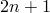

# *UNIAXIAL TEST DATA

### *UNIAXIAL TEST DATAUsed to provide uniaxial test data (compression and/or tension).

This option is used to provide uniaxial test data. It can be used only in conjunction with the [*HYPERELASTIC](ch08abk06.md) option, the [*HYPERFOAM](ch08abk07.md) option, the [*LOW DENSITY FOAM](ch12abk04.md) option, and the [*MULLINS EFFECT](ch13abk31.md) option.

**Products: **Abaqus/Standard  Abaqus/Explicit  Abaqus/CAE  

**Type: **Model data  

**Level: **Model  

**Abaqus/CAE: **Property module

##### **References:**

- ["Hyperelastic behavior of rubberlike materials," Section 22.5.1 of the Abaqus Analysis User's Guide](../usb/usb-link.md#usb-mat-chyperelastic)
- ["Hyperelastic behavior in elastomeric foams," Section 22.5.2 of the Abaqus Analysis User's Guide](../usb/usb-link.md#usb-mat-chyperfoam)
- ["Low-density foams," Section 22.9.1 of the Abaqus Analysis User's Guide](../usb/usb-link.md#usb-mat-clowdensfoam)
- ["Mullins effect," Section 22.6.1 of the Abaqus Analysis User's Guide](../usb/usb-link.md#usb-mat-cmullins)
- ["Energy dissipation in elastomeric foams," Section 22.6.2 of the Abaqus Analysis User's Guide](../usb/usb-link.md#usb-mat-cfoamdissipation)
- [*HYPERELASTIC](ch08abk06.md)
- [*HYPERFOAM](ch08abk07.md)
- [*LOW DENSITY FOAM](ch12abk04.md)
- [*MULLINS EFFECT](ch13abk31.md)

### Using uniaxial test data to define a hyperelastic material

### **Optional parameter: **

SMOOTH

Include this parameter to apply a smoothing filter to the stress-strain data. If the parameter is omitted, no smoothing is performed.

Set this parameter equal to the number *n* such that  is equal to the total number of data points in the moving window through which a cubic polynomial is fit using the least-squares method. *n* should be larger than 1. The default is SMOOTH=3.

### **Optional parameter when the [*UNIAXIAL TEST DATA](ch20abk04.md) option is used in conjunction with the [*HYPERELASTIC](ch08abk06.md), MARLOW option: **

DEPENDENCIES

Set this parameter equal to the number of field variable dependencies included in the definition of the test data. If this parameter is omitted, it is assumed that the test data depend only on temperature. 

### **Data lines to specify uniaxial test data for hyperelasticity other than the Marlow model (the nominal strains must be arranged in either ascending or descending order if the SMOOTH parameter is used): **

**First line:**

Repeat this data line as often as necessary to give the stress-strain data.

### **Data lines to specify uniaxial test data for the Marlow model (the nominal strains must be arranged in ascending order if the SMOOTH parameter is used): **

**First line:**

**Subsequent lines (only needed if the DEPENDENCIES parameter has a value greater than four):**

Repeat this set of data lines as often as necessary to define the test data as a function of temperature and other predefined field variables. Nominal strains and nominal stresses must be given in ascending order.

### Using uniaxial test data to define an elastomeric foam

**There are no parameters associated with this option.**

### **Data lines to specify uniaxial test data for a hyperfoam: **

**First line:**

Repeat this data line as often as necessary to give the stress-strain data.

### Using uniaxial test data to define a low-density foam material

### **Required parameter: **

DIRECTION

Set DIRECTION=TENSION to define tensile behavior. 

Set DIRECTION=COMPRESSION to define compressive behavior. 

### **Optional parameter: **

DEPENDENCIES

Set this parameter equal to the number of field variable dependencies included in the definition of the test data. If this parameter is omitted, it is assumed that the test data depend only on temperature. 

### **Data lines to specify uniaxial test data for [*LOW DENSITY FOAM](ch12abk04.md), LATERAL STRAIN DATA=NO: **

**First line:**

**Subsequent lines (only needed if the DEPENDENCIES parameter has a value greater than four):**

Repeat this set of data lines as often as necessary to define the test data as a function of temperature and other predefined field variables. Nominal strains, nominal strain rates and nominal stresses must be given in ascending order.

### **Data lines to specify uniaxial test data for [*LOW DENSITY FOAM](ch12abk04.md), LATERAL STRAIN DATA=YES: **

**First line:**

**Subsequent lines (only needed if the DEPENDENCIES parameter has a value greater than three):**

Repeat this set of data lines as often as necessary to define the test data as a function of temperature and other predefined field variables. Nominal strains, nominal strain rates and nominal stresses must be given in ascending order.

### Using uniaxial test data to define the Mullins effect material model

**There are no parameters associated with this option.**

### **Data lines to specify uniaxial test data for defining the unloading-reloading response of the Mullins effect material model: **

**First line:**

Repeat this data line as often as necessary to give the stress-strain data.

