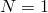

# *VISCOELASTIC

### *VISCOELASTICSpecify dissipative behavior for use with elasticity.

This option is used to generalize a material's elastic response to include viscoelasticity. The viscoelasticity can be defined as a function of frequency for steady-state small-vibration analyses, as a function of reduced time for time-dependent analyses, or by specifying a creep law for nonlinear viscoelastic analyses. 

**Products: **Abaqus/Standard  Abaqus/Explicit  Abaqus/CAE  

**Type: **Model data  

**Level: **Model  

**Abaqus/CAE: **Property module

##### **References:**

- ["Parallel rheological framework," Section 22.8.2 of the Abaqus Analysis User's Guide](../usb/usb-link.md#usb-mat-cnonlinvisco)
- ["Time domain viscoelasticity," Section 22.7.1 of the Abaqus Analysis User's Guide](../usb/usb-link.md#usb-mat-ctimevisco)
- ["Frequency domain viscoelasticity," Section 22.7.2 of the Abaqus Analysis User's Guide](../usb/usb-link.md#usb-mat-cfreqvisco)
- ["UCREEPNETWORK," Section 1.1.23 of the Abaqus User Subroutines Reference Guide](../sub/sub-link.md#sub-rtn-uucreepnetwork)
- [*COMBINED TEST DATA](ch03abk25.md)
- [*SHEAR TEST DATA](ch18abk13.md)
- [*TRS](ch19abk16.md)
- [*VOLUMETRIC TEST DATA](ch21abk08.md)

### **Required, mutually exclusive parameters: **

FREQUENCY

This parameter applies only to Abaqus/Standard analyses.

Use this parameter to choose the frequency domain definition. In this case the material's long-term elasticity must be defined using the [*ELASTIC](ch05abk03.md) or the [*HYPERELASTIC](ch08abk06.md) option. 

Set FREQUENCY=CREEP TEST DATA to define the frequency domain response using a Prony series representation of the relaxation moduli, if the Prony series parameters are to be computed from shear and volumetric creep test data.

Set FREQUENCY=FORMULA to define the dissipative material parameters by the power law formul. 

Set FREQUENCY=PRONY to define the frequency domain response using a Prony series representation of the relaxation moduli by specifying the Prony series parameters.

Set FREQUENCY=RELAXATION TEST DATA to define the frequency domain response using a Prony series representation of the relaxation moduli, if the Prony series parameters are to be computed from shear and volumetric relaxation test data.

Set FREQUENCY=TABULAR to provide tabular definition of the frequency domain response.

NONLINEAR

Include this parameter to define a nonlinear viscoelastic network within the parallel rheological framework.

TIME

Use this parameter to choose the time domain definition. In this case the material's elasticity must be defined using the [*ELASTIC](ch05abk03.md), the [*HYPERELASTIC](ch08abk06.md), or the [*HYPERFOAM](ch08abk07.md) option. 

Set TIME=CREEP TEST DATA if the Prony series parameters are to be computed by Abaqus from data taken from shear and volumetric creep tests.

Set TIME=FREQUENCY DATA if the Prony series parameters are to be computed by Abaqus from frequency-dependent cyclic test data.

Set TIME=PRONY to define a linear, isotropic, viscoelastic material by giving the parameters of the Prony series representation of the relaxation moduli.

Set TIME=RELAXATION TEST DATA if the Prony series parameters are to be computed by Abaqus from data taken from shear and volumetric relaxation tests.

### **Required parameters when the NONLINEAR parameter is included: **

LAW

 Set LAW=BERGSTROM-BOYCE to choose a Bergstrom-Boyce law.

Set LAW=HYPERB to choose a hyperbolic-sine law.

Set LAW=POWER LAW to choose a power law model.

Set LAW=STRAIN to choose a strain hardening power law.

Set LAW=USER to input the creep law using user subroutine [`UCREEPNETWORK`](../sub/sub-link.md#sub-xsl-ucreepnetwork). This value applies only to Abaqus/Standard analyses.

NETWORKID

  Set this parameter equal to the network id. This number must be greater than or equal to 1 and smaller than or equal to the number of networks. The network ids must consist of consecutive integers.

SRATIO

  Set this parameter equal to the stiffness ratio for the network. The sum of the ratios for the networks must be smaller than or equal to 1. If the sum is smaller than 1, an additional elastic network is defined with the value of the stiffness ratio such that the condition is satisfied.

### **Optional parameters: **

DEPENDENCIES

This parameter applies only to Abaqus/Standard analyses and can be used only when the NONLINEAR parameter is included.

Set this parameter equal to the number of field variable dependencies included in the definition of the creep constants in addition to temperature. If this parameter is omitted, it is assumed that the creep constants have no dependencies or depend only on temperature. See ["Specifying field variable dependence" in "Material data definition," Section 21.1.2 of the Abaqus Analysis User's Guide](../usb/usb-link.md#usb-mat-cmaterialdata-fvdepen), for more information.

PRELOAD

This parameter applies only to Abaqus/Standard analyses.

This parameter can be used only in conjunction with FREQUENCY=TABULAR to specify the nature of preload used for defining frequency-domain viscoelastic material properties or effective thickness-direction gasket properties.

Set PRELOAD=UNIAXIAL to specify that the frequency-domain viscoelastic material properties correspond to a uniaxial test.

Set PRELOAD=VOLUMETRIC to specify that the frequency-domain viscoelastic material properties correspond to a volumetric test. This setting is not meaningful when used with gasket elements to define effective thickness-direction properties.

PROPERTIES

This parameter applies only to Abaqus/Standard analyses and can be used only when LAW=USER is used.

Set this parameter equal to the number of property values needed as data in user subroutine [`UCREEPNETWORK`](../sub/sub-link.md#sub-xsl-ucreepnetwork). The default is PROPERTIES=0.

TYPE

This parameter cannot be used in conjunction with the NONLINEAR parameter.

Use this parameter to define whether the [*VISCOELASTIC](ch21abk04.md) option is being used to define continuum material properties or effective thickness-direction gasket properties.

Set TYPE=ISOTROPIC (default, and only option for Abaqus/Explicit) to define continuum material properties. This choice is appropriate when the viscoelasic material model is used for any continuum, structural, or special-purpose elements whose material response is modeled using continuum material properties (examples of such special-purpose elements include modeling cohesive elements with a continuum response—see ["Modeling of an adhesive layer of finite thickness" in "Defining the constitutive response of cohesive elements using a continuum approach," Section 32.5.5 of the Abaqus Analysis User's Guide](../usb/usb-link.md#usb-elm-ecohesivematbehavior-continuum), or gasket elements with a material response—see ["Defining the gasket behavior using a material model," Section 32.6.5 of the Abaqus Analysis User's Guide](../usb/usb-link.md#usb-elm-egasketmatbehavior)). In Abaqus/Explicit this parameter should also be used for the definition of viscoelastic properties for cohesive elements with elastic traction-separation behavior (["Modeling rate-dependent traction-separation behavior in Abaqus/Explicit" in "Defining the constitutive response of cohesive elements using a traction-separation description," Section 32.5.6 of the Abaqus Analysis User's Guide](../usb/usb-link.md#usb-elm-ecohesivebehavior-timevisco)).

Set TYPE=TRACTION to define effective thickness-direction gasket properties. This option is supported only for gasket elements whose behavior is modeled directly using a gasket behavior model (["Defining the gasket behavior using a material model," Section 32.6.5 of the Abaqus Analysis User's Guide](../usb/usb-link.md#usb-elm-egasketmatbehavior)).

### **Optional parameters when test data are given to define time domain viscoelasticity with TIME=CREEP TEST DATA, TIME=RELAXATION TEST DATA, or TIME=FREQUENCY DATA or when test data are given to define frequency domain viscoelasticity with FREQUENCY=CREEP TEST DATA or FREQUENCY=RELAXATION TEST DATA: **

ERRTOL

Set this parameter equal to the allowable average root-mean-square error of the data points in the least-squares fit. The default is 0.01 (1%).

NMAX

Set this parameter equal to the maximum number of terms *N* in the Prony series. Abaqus will perform the least-squares fit from  to  NMAX until convergence is achieved for the lowest *N* with respect to ERRTOL. The default and maximum value is 13.

### **Data line to define continuum material properties for FREQUENCY=FORMULA: **

**First (and only) line:**

### **Data lines to define continuum material properties for FREQUENCY=TABULAR without the PRELOAD parameter or for TIME=FREQUENCY DATA: **

**First line:**

Repeat this data line as often as necessary to define the dissipative part of the material behavior.

### **Data lines to define continuum material properties for FREQUENCY=TABULAR, PRELOAD=UNIAXIAL: **

**First line:**

Repeat this data line as often as necessary to define the uniaxial loss and storage moduli as functions of frequency and preload.

### **Data lines to define continuum material properties for FREQUENCY=TABULAR, PRELOAD=VOLUMETRIC: **

**First line:**

Repeat this data line as often as necessary to define the bulk loss and storage moduli as functions of frequency and preload.

### **Data lines to specify continuum material properties with the Prony series parameters directly using TIME=PRONY or FREQUENCY=PRONY: **

**First line:**

Repeat this data line as often as necessary to define the second, third, etc. terms in the Prony series. There is no restriction on the number of terms in the Prony series.

### **Data lines to define viscoelastic properties for cohesive elements with elastic traction-separation behavior using TIME=PRONY: **

**First line:**

Repeat this data line as often as necessary to define the second, third, etc. terms in the Prony series. There is no restriction on the number of terms in the Prony series.

### **Data lines to define viscoelastic properties for cohesive elements with elastic traction-separation behavior using TIME=FREQUENCY DATA: **

**First line:**

Repeat this data line as often as necessary to define the dissipative part of the material behavior.

### **To specify viscoelastic behavior via test data: **

No data lines are used with this option when either TIME=CREEP TEST DATA or TIME=RELAXATION TEST DATA is specified. The test data are given by the [*SHEAR TEST DATA](ch18abk13.md) and the [*VOLUMETRIC TEST DATA](ch21abk08.md) options or by the [*COMBINED TEST DATA](ch03abk25.md) option.

### **Data lines to define effective thickness-direction gasket properties for PRELOAD=UNIAXIAL: **

**First line:**

Repeat this data line as often as necessary to define the effective thickness-direction gasket loss and storage moduli as functions of frequency and preload.

### **Data lines to define effective thickness-direction gasket properties if PRELOAD=UNIAXIAL is not included: **

**First line:**

Repeat this data line as often as necessary to define the normalized effective thickness-direction gasket loss and storage moduli as functions of frequency.

### **Data lines for LAW=BERGSTROM-BOYCE: **

**First line:**

**Subsequent lines (only needed if the DEPENDENCIES parameter has a value greater than four):**

Repeat this set of data lines as often as necessary to define the dependence of the creep constants on temperature and other predefined field variables.

### **Data lines for LAW=HYPERB: **

**First line:**

**Subsequent lines (only needed if the DEPENDENCIES parameter has a value greater than five):**

Repeat this set of data lines as often as necessary to define the dependence of the creep constants on predefined field variables.

### **Data lines for LAW=POWER LAW: **

**First line:**

**Subsequent lines (only needed if the DEPENDENCIES parameter has a value greater than four):**

Repeat this set of data lines as often as necessary to define the dependence of the creep constants on temperature and other predefined field variables.

### **Data lines for LAW=STRAIN: **

**First line:**

**Subsequent lines (only needed if the DEPENDENCIES parameter has a value greater than four):**

Repeat this set of data lines as often as necessary to define the dependence of the creep constants on temperature and other predefined field variables.

### **Data lines for LAW=USER: **

**No data lines are needed if the PROPERTIES parameter is omitted or set to 0. Otherwise, first line:**

Repeat this data line as often as necessary to define the material properties.

