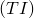
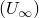
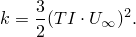

# 8.2 Abaqus/CFD  prescribed条件的增强

**产品：**Abaqus/CFD  

**优点：**为湍流模型变量指定初始条件和边界条件的过程已得到增强，使其更加直观和灵活。

**说明：**您现在可以指定更直观的湍流量，例如湍流强度或湍流粘度比，Abaqus/CFD 会计算湍流模型变量的实际值。以前，您需要预先计算湍流变量的值。新的湍流量可用于为所有湍流模型指定初始条件和边界条件。例如，您可以 prescribed 湍流强度  和特征速度尺度  来为 *k*– RNG、*k*– realizable 和 *k*– SST 湍流模型指定湍流动能，公式如下：

**参考：**

**Abaqus Analysis User's Guide**
- ["Initial conditions in Abaqus/CFD," Section 34.2.2](../usb/usb-link.md#usb-prc-pinitialcondcfd)
- ["Boundary conditions in Abaqus/CFD," Section 34.3.2](../usb/usb-link.md#usb-prc-pboundarycfd)

**Abaqus Keywords Reference Guide**
- [*FLUID BOUNDARY](../key/key-link.md#usb-kws-hfluidboundary)
- [*INITIAL CONDITIONS](../key/key-link.md#usb-kws-minitialcond)

