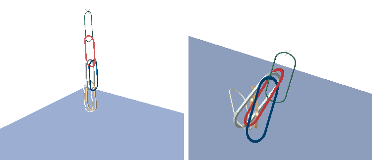
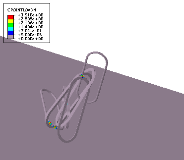

# 10.1 Abaqus/Standard 中通用接触的边对边接触

**产品：**Abaqus/Standard  

**优点：**边对边接触已扩展到包括实体和壳状表面上的特征边以及壳周长边缘，以便更加自动化和稳健地解决边缘之间的接触。新的接触输出变量允许可视化边对边接触的接触 enforcement。

**说明：**实体和壳状表面上的特征边以及壳周长边缘现在可以参与通用接触框架内的边对边接触。与上一版本相比，这些更改大大扩展了边对边接触能力，在上一版本中仅支持梁表面边缘之间的接触（梁对梁接触）。各种稳健性和精度改进也已完成。虽然边对边接触是梁之间接触的主要公式，但在其他情况下（例如，在特征边之间），它补充了边对表面和表面对表面的接触公式。

提供了新的表面节点输出变量 CLINELOAD 和 CPOINTLOAD，用于可视化涉及边缘的活动接触区域中的接触载荷。输出变量 CLINELOAD 的单位是单位长度的力，并在活动接触区域为曲线而非面积时提供与网格无关的接触载荷度量。使用径向公式的梁对梁接触和边对表面接触对该输出变量有贡献。输出变量 CPOINTLOAD 的单位是力，有助于可视化非平行边缘之间的接触，其中活动接触区域可以理想化为一个点。接触应力 CSTRESS 反映了表面对表面、边对表面和边对边接触的贡献，单位是单位面积的力。

[图 10--1](abc10aqs01.md#rnb-inter-chain-defo-unde) 显示了在重力作用下坠落的链环的初始和变形配置。各个链环使用梁、壳或实体单元进行网格划分，使得梁、壳周长和特征边被激活以参与边对边接触。边对边接触补充了边对表面和表面对表面的接触，这些接触在该模型中也是活跃的，发生在各个链环之间以及链环和刚性平台之间。[图 10--2](abc10aqs01.md#rnb-inter-chain-cpointload) 显示了由于边对边接触，各个链环边缘之间的接触载荷 CPOINTLOAD。

**图 10-1** 在重力作用下落到刚性平台上的链环：初始（左）和变形（右）配置。

**图 10-2** 接触载荷 CPOINTLOAD 的等值线图。

**参考：**

**Abaqus Analysis User's Guide**
- ["Abaqus/Standard output variable identifiers," Section 4.2.1](../usb/usb-link.md#usb-out-houtputvar)
- ["Contact interaction analysis: overview," Section 36.1.1](../usb/usb-link.md#usb-cni-acontactoverview)
- ["Defining general contact interactions in Abaqus/Standard," Section 36.2.1](../usb/usb-link.md#usb-cni-acontactgeneralstd)
- ["Surface properties for general contact in Abaqus/Standard," Section 36.2.2](../usb/usb-link.md#usb-cni-asurfacepropassignstd)

**Abaqus Keywords Reference Guide**
- [*CONTACT FORMULATION](../key/key-link.md#usb-kws-hcontformulation)
- [*CONTACT OUTPUT](../key/key-link.md#usb-kws-hcontactoutput)
- [*SURFACE PROPERTY ASSIGNMENT](../key/key-link.md#usb-kws-hsurfpropassign)

