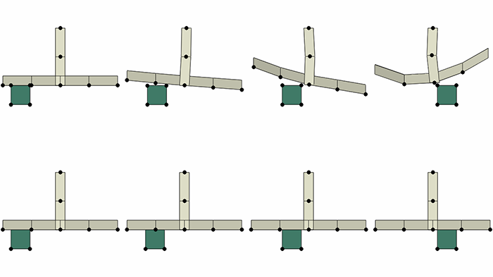

# 10.2 Abaqus/Explicit 中复杂交叉处的接触改进

**产品：**Abaqus/Explicit  

**优点：**复杂交叉处（连接到两个以上面的边缘）的接触已得到改进。

**说明：**在 Abaqus/Explicit 的以前版本中，复杂交叉处的表面偏移始终设置为零，即使您为底层单元指定了非零参考表面偏移。此限制有时会导致不良的解决方案行为。此限制已在当前版本中移除。

[图 10--3](abc10aqs02.md#rnb614-complex-int) 显示了一个场景，其中一个块沿着壳单元滑动，壳单元的参考表面对应于壳的底面。壳的底面恰好对应于壳参考表面，因为已指定了非零偏移。较大物体具有 T 形交叉这一事实应该与该模型不特别相关，但以前的限制（表面偏移设置为零）导致 T 形交叉产生了很大的影响。

壳单元厚度分布表示在[图 10--3](abc10aqs02.md#rnb614-complex-int)中，但这些分布没有反映以前限制对接触表面几何形状的影响。[图 10--3](abc10aqs02.md#rnb614-complex-int) 顶部四个变形配置图的序列显示了以前限制的影响，因为块接近 T 形交叉：身体之间出现间隙（即使仍在传递显著的接触力）。即使块已很好地通过 T 形交叉之后，此示例中仍存在解噪声。[图 10--3](abc10aqs02.md#rnb614-complex-int) 底部的图序列显示了改进的（物理上真实的）行为。在这种情况下，块简单地沿着另一个物体滑动，正如预期的那样，两个部件的变形都很小。

此增强默认情况下处于启用状态。

**图 10-3** 块在 T 形交叉结构的平坦部分上滑动的以前行为（顶部）和当前行为（底部）。

**参考：**

**Abaqus Analysis User's Guide**
- ["Surface offset" in "Assigning surface properties for general contact in Abaqus/Explicit," Section 36.4.2](../usb/usb-link.md#usb-cni-asurfacepropassign-offset)

