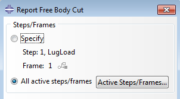

# 12.9 从多个帧生成自由体切割的表格报告


**产品：**Abaqus/CAE  

**优点：**您现在可以从多个帧创建自由体切割中合力和力矩的表格报告。此增强也适用于基于视图切割的自由体切割。

**说明：**在为自由体切割报告选择选项时，您可以选择 Abaqus/CAE 从中读取数据的帧，如图 [图 12--1](abc12aqs09.md#rnb614-report) 所示。您可以选择使用当前步骤/帧、所有活动步骤/帧或选定的活动步骤/帧。对于多个帧，时间与每个帧关联包含在报告中。

**图 12-1** 为自由体切割报告选择多个步骤/帧。



**Abaqus/CAE 使用方法：**
```
Visualization 模块:
    ****Report****Free Body Cut****; **All active steps/frames**
```

**参考：**

**Abaqus/CAE User's Guide**
- ["Selecting options and thresholds for free body cut reports," Section 54.3.4](../usi/usi-link.md#usv-report-freebody)

