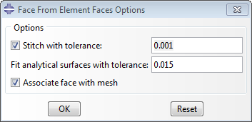

# 3.10 Associating geometric faces created from an orphan mesh with the mesh


**Product: **Abaqus/CAE  

**Benefits: **When you create a geometric face from orphan element faces in a part, Abaqus/CAE now associates the new face with the mesh by default.

**Description: **You can use the Geometry Edit toolset to create geometry from the faces of orphan mesh elements. By default, the new geometric face is associated with the mesh; you have the option to change this behavior, as shown in [Figure 3--1](abc03aqs10.md#rnb614-face-from-elem-face).

**Figure 3–1** Options for creating geometric faces from orphan element faces.



**Abaqus/CAE Usage: **
```
Part module:
    ****Tools****Geometry Edit****; **Face**: **From element faces**; **Options**: toggle **Associate face with mesh** 
```

**Reference: **

**Abaqus/CAE User's Guide**
- ["Create face from element faces," Section 69.7.10](../usi/usi-link.md#usi-rep-help-repair-fromelem)


