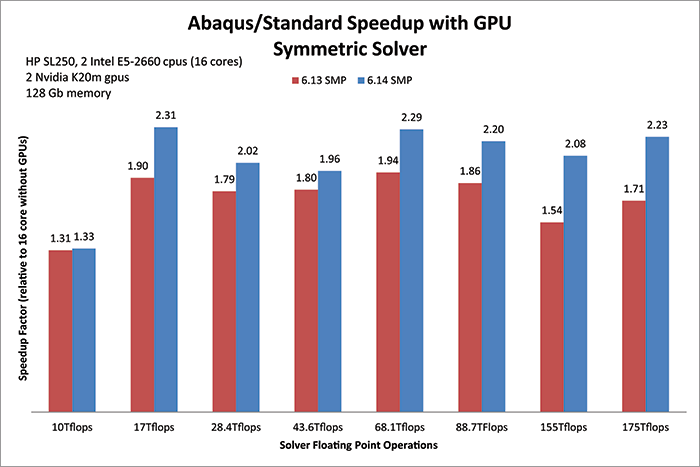

# 11.2 GPGPU accelerated direct equation solver

**Product: **Abaqus/Standard  

**Benefits: **Performance of the GPGPU accelerated direct equation solver has been improved, and GPGPU memory requirements have been reduced. 

**Description: ** For large models where the solution time is dominated by the direct equation solver, use of GPGPU can reduce the overall time of the analysis significantly, as shown in [Figure 11--1](abc11aqs02.md#rnb614-symm-solver-speedup). These types of models use predominantly solid elements and have more than 1 million equations.

**Figure 11–1** GPGPU accelerated direct solver performance improvement.

**Reference: **

**Abaqus Analysis User's Guide**
- ["Parallel execution in Abaqus/Standard," Section 3.5.2](../usb/usb-link.md#usb-int-astdparallel)

