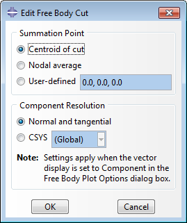

# 12.10 Selecting the area centroid as the summation point for free body cuts


**Product: **Abaqus/CAE  

**Benefits: **A new option is available for specifying the summation point for free body cuts.

**Description: **For the summation point in free body calculations, you can now specify that the area centroid or the nodal average be used.

In previous releases the **Centroid of cut** option in the **Edit Free Body Cut** dialog box placed the summation point at the average of the nodal coordinates of the selected elements of the free body cross-section. That behavior is now obtained by choosing the **Nodal average** option.

Now when you choose the **Centroid of cut** option for the summation point, the area centroid of the polygon formed by the external boundary edges of the selected faces is used in the free body calculations. [Figure 12--2](abc12aqs10.md#rnb614-freebody) shows the available options for the summation point in free body cuts. 

**Figure 12–2** Summation point options.



**Abaqus/CAE Usage: **
```
Visualization module:
    ****Tools****Free Body Cut****Create****; **Summation Point**: **Centroid of cut** or **Nodal average**
```

**Reference: **

**Abaqus/CAE User's Guide**
- ["Creating or editing a free body cut," Section 67.2](../usi/usi-link.md#usi-fbd-hlp-create)


