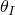
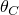

# 2.3 AdaptiveMeshControl 对象


AdaptiveMeshControl 对象用于控制应用于 ALE 自适应网格域的任意拉格朗日欧拉（ALE）样式自适应平滑和平流算法的各个方面。

**访问**

```
import step
mdb.models[*name*].adaptiveMeshControls[*name*]
```

### 2.3.1 AdaptiveMeshControl(...)

此方法创建一个 AdaptiveMeshControl 对象。

**路径**

```
mdb.models[*name*].AdaptiveMeshControl
```

**必需参数**

*name*

一个 String，指定对象的名称。

**可选参数**

*remapping*

一个 SymbolicConstant，指定重映射算法。可能的值为 FIRST_ORDER_ADVECTION 和 SECOND_ORDER_ADVECTION。默认值为 SECOND_ORDER_ADVECTION。

*smoothingAlgorithm*

一个 SymbolicConstant，指定要使用的平滑算法类型。可能的值为 STANDARD 和 GEOMETRY_ENHANCED。默认值为 GEOMETRY_ENHANCED。

*smoothingPriority*

一个 SymbolicConstant，指定要执行的平滑类型。可能的值为 UNIFORM 和 GRADED。默认值为 UNIFORM。

*initialFeatureAngle*

一个 Float，指定初始几何特征角，，以度为单位。可能的值为 0  180。默认值为 30.0。

*transitionFeatureAngle*

一个 Float，指定过渡特征角，，以度为单位。可能的值为 0  180。默认值为 30.0。

*momentumAdvection*

一个 SymbolicConstant，指定动量平流算法类型。可能的值为 ELEMENT_CENTER_PROJECTION 和 HALF_INDEX_SHIFT。默认值为 ELEMENT_CENTER_PROJECTION。

*meshingPredictor*

一个 SymbolicConstant，指定用于网格重生成的节点起始位置。可能的值为 CURRENT 和 PREVIOUS。默认值为 CURRENT。

*curvatureRefinement*

一个 Float，指定解相依权重，。可能的值为 0.0  1.0。默认值为 1.0。

*volumetricSmoothingWeight*

一个 Float，指定 Abaqus/Explicit 用于体积平滑方法的权重。默认值为 1.0。

*laplacianSmoothingWeight*

一个 Float，指定拉普拉斯平滑方法的权重。默认值为 0.0。

*equipotentialSmoothingWeight*

一个 Float，指定等势平滑方法的权重。默认值为 0.0。

*meshConstraintAngle*

一个 Float，指定初始几何特征角，。可能的值为 0  180。默认值为 60.0。

*originalConfigurationProjectionWeight*

一个 Float，指定原始构型投影方法的权重。默认值为 1.0。

*standardVolumetricSmoothingWeight*

一个 Float，指定 Abaqus/Standard 用于体积平滑方法的权重。默认值为 0.0。

**返回值**

一个 AdaptiveMeshControl 对象。

**异常**

RangeError。

### 2.3.2 setValues(...)

此方法修改 AdaptiveMeshControl 对象。

**必需参数**

无。

**可选参数**

`setValues` 的可选参数与 [AdaptiveMeshControl](pt01ch02pyo03.md#ker-adaptivemeshcontrol-adaptivemeshcontrol-pyc) 方法的参数相同，但 *name* 参数除外。

**返回值**

无

**异常**

RangeError。

### 2.3.3 成员

AdaptiveMeshControl 对象具有与 [AdaptiveMeshControl](pt01ch02pyo03.md#ker-adaptivemeshcontrol-adaptivemeshcontrol-pyc) 方法参数相同名称和描述的成员。


