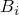

# 3.8 PeriodicAmplitude 对象


PeriodicAmplitude 对象使用傅里叶级数定义幅度曲线。

PeriodicAmplitude 对象派生自 [Amplitude](pt01ch03pyo01.md) 对象。

**访问**

```
import amplitude
mdb.models[*name*].amplitudes[*name*]
import odbAmplitude
session.odbs[*name*].amplitudes[*name*]
```

### 3.8.1 PeriodicAmplitude(...)

此方法创建一个 PeriodicAmplitude 对象。

**路径**

```
mdb.models[*name*].PeriodicAmplitude
session.odbs[*name*].PeriodicAmplitude
```

**必需参数**

*name*

一个 String，指定仓库键。

*frequency*

一个 Float，指定圆频率 。可能的值为正数。

*start*

一个 Float，指定开始时间 。可能的值为正数。

*a_0*

一个 Float，指定常数 。

*data*

一个 Float 对序列，指定  和  对。

**可选参数**

*timeSpan*

一个 SymbolicConstant，指定幅度的时间跨度。可能的值为 STEP 和 TOTAL。默认值为 STEP。

**返回值**

一个 PeriodicAmplitude 对象。

**异常**

InvalidNameError 和 RangeError。

### 3.8.2 setValues(...)

此方法修改 PeriodicAmplitude 对象。

**必需参数**

无。

**可选参数**

`setValues` 的可选参数与 [PeriodicAmplitude](pt01ch03pyo08.md#ker-periodicamplitude-periodicamplitude-pyc) 方法的参数相同，但 *name* 参数除外。

**返回值**

无

**异常**

RangeError。

### 3.8.3 成员

PeriodicAmplitude 对象具有与 [PeriodicAmplitude](pt01ch03pyo08.md#ker-periodicamplitude-periodicamplitude-pyc) 方法参数相同名称和描述的成员。

### 3.8.4 对应分析关键字

| [*AMPLITUDE](../key/key-link.md#usb-kws-mamplitude) |
| --- |


