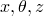
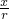

# 18.2 Part 对象


以下命令对 Part 对象进行操作。有关 Part 对象的更多信息，请参阅"Part 对象"第 37.1 节。

**访问**

```
import meshEdit
```

### 18.2.1 adjustMidsideNode(...)

此方法用于调整孤立网格部件的二阶元素的中点节点。

**必需参数**

*cornerNodes*

一个 Node 对象序列，指定将偏置连接中点节点的节点。

*parameter*

一个 Float，指定沿边缘的标准化距离，范围为 0.0 ≤ *parameter* ≤ 1.0，其中 0.0 指定角节点的位置。默认值为 0.5。

**可选参数**

无。

**返回值**

无

**异常**

无。

### 18.2.2 cleanMesh(...)

此方法用于折叠短元素边缘并删除折叠的元素，或在由线性元素组成的孤立网格部件上生长短元素边缘。

**必需参数**

*mergeTolerance*

一个 Float，指定边缘长度容差。在操作期间，短于给定容差的边缘将被折叠，或生长到指定长度。

**可选参数**

*growEdges*

一个 Boolean，指定是否将短元素边缘生长到指定容差。默认为 False，意为短边缘将被折叠。

*elements*

要作为操作域考虑的元素。默认情况下会考虑部件上的所有元素。元素可以给定为 [MeshElementArray](pt01ch31pyo05.md)、[MeshElement](pt01ch31pyo05.md) 对象列表、[Set](pt01ch45pyo04.md) 或 [Set](pt01ch45pyo04.md) 对象列表。

*refEdge*

一个 [MeshEdge](pt01ch31pyo04.md)，指定参考边缘以指示结构网格中的拓扑方向，这将限制考虑元素域中的哪些边缘。也就是说，只有被发现与给定参考边缘拓扑平行的边缘才会被操作考虑。默认情况下会考虑元素域的所有边缘，除非指定了 *thicknessDir*，在这种情况下，操作将尝试从厚度方向确定拓扑边缘。

*thicknessDir*

一个包含两个或三个 Float 的元组，指示用于测量元素边缘长度的向量。

*moveLayers*

一个 Boolean，指示是否将沿 *thicknessDir* 指定的厚度向量方向生长元素边缘。当此参数为 True 时，任何给定元素边缘的生长不再受到相邻元素上短边缘的约束，但元素可能从其原始位置移动（当有多个相邻的薄元素层时）。默认值为 False。

**返回值**

无

**异常**

无。

### 18.2.3 collapseMeshEdge(...)

此方法折叠孤立网格部件或部件实例的四边形或三角形元素的边缘。

**必需参数**

*edge*

一个单一的 [MeshEdge](pt01ch31pyo04.md) 对象，指定要折叠的元素边缘。

*collapseMethod*

一个 SymbolicConstant，指定用于折叠边缘的方法。可能的值为 FORWARD、REVERSE 和 AVERAGE。

**可选参数**

无。

**返回值**

无

**异常**

无。

### 18.2.4 combineElement(...)

此方法组合孤立网格部件或 Abaqus 原生网格的两个三角形元素。

**必需参数**

*elements*

一个三角形 [MeshElement](pt01ch31pyo05.md) 对象序列，指定要组合的元素。

**可选参数**

无。

**返回值**

无

**异常**

无。

### 18.2.5 convertSolidMeshToShell()

此方法从孤立网格部件中移除所有实体元素，并沿其外表面创建三角形或四边形壳元素。

**参数**

无。

**返回值**

无

**异常**

无。

### 18.2.6 deleteElement(...)

此方法从孤立网格部件或 Abaqus 原生网格中删除给定元素。如果元素属于 Abaqus 原生网格，则元素必须使用自底向上网格技术生成。

**必需参数**

*elements*

一个 [MeshElement](pt01ch31pyo05.md) 对象序列或包含元素的 Set 对象。

**可选参数**

*deleteUnreferencedNodes*

一个 Boolean，指定是否删除在给定元素被删除后变得未被引用的所有关联节点。默认值为 OFF。

**返回值**

无

**异常**

无。

### 18.2.7 deleteNode(...)

此方法从孤立网格部件中删除给定节点。

**必需参数**

*nodes*

包含节点的 MeshNode 对象序列或 Set 对象。

**可选参数**

*deleteUnreferencedNodes*

一个 Boolean，指定是否删除在给定节点和连接元素被删除后变得未被引用的所有关联节点。默认值为 OFF。

**返回值**

无

**异常**

无。

### 18.2.8 editNode(...)

此方法更改孤立网格部件或 Abaqus 原生网格上给定节点的坐标。

**必需参数**

*nodes*

包含节点的 MeshNode 对象序列或 Set 对象。

**可选参数**

*coordinate1*

一个 Float，指定第一个坐标的值。如果 *coordinate1* 和 *offset1* 都未指定，则现有值不变。

*coordinate2*

一个 Float，指定第二个坐标的值。如果 *coordinate2* 和 *offset2* 都未指定，则现有值不变。

*coordinate3*

一个 Float，指定第三个坐标的值。如果 *coordinate3* 和 *offset3* 都未指定，则现有值不变。

*coordinates*

一个三维坐标元组序列，指定每个给定节点的坐标。指定时，坐标元组的数量必须与给定节点的数量匹配，并按节点索引升序与给定节点对应排列。此外，不能指定 *coordinate1*、*coordinate2*、*coordinate3*、*offset1*、*offset2* 或 *offset3*。

*offset1*

一个 Float，指定要应用于指定节点第一个坐标值的偏移量。

*offset2*

一个 Float，指定要应用于指定节点第二个坐标值的偏移量。

*offset3*

一个 Float，指定要应用于指定节点第三个坐标值的偏移量。

*localCsys*

一个 DatumCsys 对象，指定局部坐标系。如果未指定，将使用全局坐标系。

*projectToGeometry*

一个 Boolean，指定是否将节点投影回其原始几何。例如，如果节点在一个面上，此方法首先将节点定位到新位置，然后将其投影回原始面。默认值为 ON。

**返回值**

无

**异常**

同一坐标分量不能同时指定坐标和偏移量。

### 18.2.9 projectNode(...)

此方法将给定节点投影到网格实体、几何实体或基准对象上。节点可以属于孤立网格部件或 Abaqus 原生网格。

**必需参数**

*nodes*

要投影的 [MeshNode](pt01ch31pyo09.md) 对象序列。

*projectionReference*

一个对象，指定节点投影操作的目标。*projectionReference* 可以是以下任一对象：[MeshNode](pt01ch31pyo09.md)、[MeshEdge](pt01ch31pyo04.md)、[MeshFace](pt01ch31pyo08.md)、[Vertex](pt01ch07pyo15.md)、[Edge](pt01ch07pyo03.md)、[Face](pt01ch07pyo05.md)、[DatumPoint](pt01ch15pyo05.md)、[DatumAxis](pt01ch15pyo02.md) 或 [DatumPlane](pt01ch15pyo04.md)。

**可选参数**

无。

**返回值**

无

**异常**

无。

### 18.2.10 generateMesh(...)

此方法基于原始网格在孤立网格部件上生成新网格。

**必需参数**

无。

**可选参数**

*elemShape*

一个 SymbolicConstant，指定用于网格化的元素形状。可能的值为：

**TRI**

细化平面三角形网格并将其替换为新网格。如果没有附加元素大小，新网格将受旧网格边界边缘大小的控制。

**TET**

从闭合的三角形外壳创建四面体网格。

**返回值**

无

**异常**

无。

### 18.2.11 generateMeshByOffset(...)

此方法通过从孤立网格表面向外法向生成元素层，从孤立网格表面生成实体或壳网格。

**必需参数**

*region*

一个 Region 对象，指定要偏移的区域。

*meshType*

一个 Symbolic Constant，指定要生成的网格类型。可能的值为 SOLID 或 SHELL。

*totalThickness*

一个 Float，指定实体层的总厚度。此参数仅在 *meshType*=SOLID 时适用。

*distanceBetweenLayers*

一个 Float，指定壳层之间的距离。此参数仅在 *meshType*=SHELL 时适用。

*numLayers*

一个 Int，指定要生成的元素层数。

**可选参数**

*offsetDirection*

一个 Symbolic Constant，指定偏移方向。此参数仅在给定区域涉及壳网格时是必需的。可能的值为 OUTWARD、INWARD 和 BOTH。默认值为 OUTWARD。

*initialOffset*

一个 Float，指定初始偏移的大小。默认值为零。

*shareNodes*

Boolean，指定第一层节点是否应与底面上的节点共享。默认值为 False。

*deleteBaseElements*

一个 Boolean，指定在生成偏移层后是否删除壳元素。默认值为 False。此参数仅在 *meshType*=SHELL 时适用。

*constantThicknessCorners*

一个 Boolean，指定是使用基于元素的厚度还是基于节点的厚度。默认值为 False。

*extendElementSets*

一个 Boolean，指定是否将包含底元素的现有元素集扩展到包括相应的偏移元素。默认值为 False。

**返回值**

无

**异常**

无。

### 18.2.12 mergeNodes(...)

合并孤立网格部件的节点，或使用自底向上网格技术生成的节点。

**必需参数**

*nodes*

一个 Node 对象序列，指定要合并的节点。

**可选参数**

*tolerance*

一个 Float，指定将合并到单个节点的两个节点之间的最大距离。新节点的位置是合并节点的平均位置。默认值为 10⁻⁶。

*removeDuplicateElements*

一个 Boolean，指定是否将具有相同连接性的元素在合并后合并为单个元素。默认值为 True。

*keepHighLabels*

一个 Boolean，指定节点合并后哪些节点标签将保留。如果为 True，则保留最高的节点标签；当为 False 时，则保留最低的节点标签。默认值为 False。此参数仅适用于合并孤立网格节点。

**返回值**

无

**异常**

无。

### 18.2.13 mergeElement(...)

将孤立网格部件上排列成层的元素选择合并为单个层。

**必需参数**

*edge*

一个 [MeshEdge](pt01ch31pyo04.md)，属于指定元素之一，用作参考边缘以指示合并元素的拓扑方向。所有指定的元素必须能够从此元素边缘进行拓扑导航，拓扑方向必须明确。

*elements*

一个 [MeshElementArray](pt01ch31pyo05.md)、[MeshElement](pt01ch31pyo05.md) 对象列表、[Set](pt01ch45pyo04.md) 或 [Set](pt01ch45pyo04.md) 对象列表，包含要包括在合并操作中的元素。

**可选参数**

无。

**返回值**

无

**异常**

无。

### 18.2.14 mergeNodes(...)

合并孤立网格部件或 Abaqus 原生网格的两个节点。如果节点属于 Abaqus 原生网格，则至少有一个节点必须使用自底向上网格技术生成。

**必需参数**

*node1*

一个 [MeshNode](pt01ch31pyo09.md) 对象，指定要合并的第一个节点。

*node2*

一个 [MeshNode](pt01ch31pyo09.md) 对象，指定要合并的第二个节点。

**可选参数**

*removeDuplicateElements*

一个 Boolean，指定是否将具有相同连接性的元素在合并后合并为单个元素。默认值为 True。

*keepHighLabels*

一个 Boolean，指定节点合并后将保留哪个节点标签。如果为 True，则保留较高的节点标签；当为 False 时，则保留较低的节点标签。默认值为 False。此参数仅适用于合并孤立网格节点。

**返回值**

无

**异常**

无。

### 18.2.15 orientElements(...)

此方法定向连续壳或垫片网格中元素的堆叠方向。

**必需参数**

*pickedElements*

一个 [MeshElement](pt01ch31pyo05.md) 对象序列，指定要定向的元素。

*referenceRegion*

一个 [MeshFace](pt01ch31pyo08.md) 对象，指定指示所需方向的参考顶面。

**可选参数**

无。

**返回值**

无

**异常**

无。

### 18.2.16 removeElementSize()

此方法从孤立网格部件中移除全局元素大小。

**参数**

无。

**返回值**

无

**异常**

无。

### 18.2.17 renumberElement(...)

此方法为孤立网格元素分配新标签。

**必需参数**

无。

**可选参数**

必须指定 *startLabel* 和 *increment*，或 *offset*，或 *labels*。

*elements*

一个 [MeshElementArray](pt01ch31pyo05.md) 或 [MeshElement](pt01ch31pyo05.md) 对象的元组或列表，或包含要重新编号的元素的 [Set](pt01ch45pyo04.md)。如果未指定，将对部件中的所有元素进行重新编号。

*startLabel*

一个正 Int，指定 *elements* 中第一个元素的新标签。

*increment*

一个正 Int，指定用于计算 *elements* 中所有连续元素的新标签的增量。

*offset*

一个 Int，现有指定元素的标签将偏移该值。

*labels*

指定元素的一组标签。此列表的长度必须与指定元素的数量匹配。

**返回值**

无

**异常**

对原生部件尝试重新编号：

```
Error: Renumbering can be applied to orphan mesh parts only
```

重新编号数据指定不正确：

```
Error: Either startLabel and increment or offset must be specified
```

重新编号将导致无效标签：

```
Error: Specified data will result in invalid labels
```

重新编号将导致冲突标签：

```
Error: Specified data will result in conflicting labels
```

### 18.2.18 renumberNode(...)

此方法为孤立网格节点分配新标签。

**必需参数**

无。

**可选参数**

必须指定 *startLabel* 和 *increment*，或 *offset*，或 *labels*。

*nodes*

一个 [MeshNodeArray](pt01ch31pyo09.md) 或 [MeshNode](pt01ch31pyo09.md) 对象的元组或列表，或包含要重新编号的节点的 [Set](pt01ch45pyo04.md)。如果未指定，将对部件中的所有节点进行重新编号。

*startLabel*

一个正 Int，指定 *nodes* 中第一个节点的新标签。

*increment*

一个正 Int，指定用于计算 *nodes* 中所有连续节点的新标签的增量。

*offset*

一个 Int，现有指定节点的标签将偏移该值。

*labels*

指定节点的一组标签。此列表的长度必须与指定节点的数量匹配。

**返回值**

无

**异常**

对原生部件尝试重新编号：

```
Error: Renumbering can be applied to orphan mesh parts only
```

重新编号数据指定不正确：

```
Error: Either startLabel and increment or offset must be specified
```

重新编号将导致无效标签：

```
Error: Specified data will result in invalid labels
```

重新编号将导致冲突标签：

```
Error: Specified data will result in conflicting labels
```

### 18.2.19 setElementSize(...)

此方法设置孤立网格部件的全局元素大小。

**必需参数**

*size*

一个 Float，指定所需的元素大小。

**可选参数**

无。

**返回值**

无

**异常**

无。

### 18.2.20 splitElement(...)

此方法将孤立网格部件或 Abaqus 原生网格的四边形元素拆分为三角形元素。

**必需参数**

*elements*

一个四边形 [MeshElement](pt01ch31pyo05.md) 对象序列，指定要拆分的元素。每个四边形元素通过较短的的对角线拆分为两个三角形元素。

**可选参数**

无。

**返回值**

无

**异常**

无。

### 18.2.21 splitMeshEdge(...)

此方法拆分孤立网格部件或 Abaqus 原生网格的四边形或三角形元素的边缘。

**必需参数**

*edge*

一个单一的 [MeshEdge](pt01ch31pyo04.md) 对象，指定要拆分的元素边缘。

**可选参数**

*parameter*

一个 Float，指定沿 *edge* 拆分的标准化距离。可能的值为 0.0 ≤ *parameter* ≤ 1.0。默认值为 0.5。

**返回值**

无

**异常**

无。

### 18.2.22 subdivideElement(...)

在一个或多个方向上细分孤立网格部件上的元素选择。

**必需参数**

无。

**可选参数**

*elements*

一个 [MeshElementArray](pt01ch31pyo05.md)、[MeshElement](pt01ch31pyo05.md) 对象列表、[Set](pt01ch45pyo04.md) 或 [Set](pt01ch45pyo04.md) 对象列表，包含要细分的元素。默认情况下会细分部件的所有元素。

*divisionNumber*

一个 Int，指定每个输入元素在每个细分方向上产生的元素数量。如果未指定 *face* 或 *edge*，元素将按此数字在所有可能的方向上细分。必须大于一。默认为 2。

*face*

一个 [MeshFace](pt01ch31pyo08.md) 对象，用作参考以指示细分操作的两个拓扑方向。必须是指定元素之一的面，并且所有指定的元素必须能够从此元素面进行拓扑导航。不能与 *edge* 组合。

*edge*

一个 [MeshEdge](pt01ch31pyo04.md) 对象，用作参考以指示细分操作的单个拓扑方向。必须是指定元素之一的边缘，并且所有指定的元素必须能够从此元素边缘进行拓扑导航。不能与 *face* 组合。

**返回值**

无

**异常**

无。

### 18.2.23 swapMeshEdge(...)

此方法交换孤立网格部件或 Abaqus 原生网格的两个相邻三角形元素的的对角线。

**必需参数**

*edge*

一个单一的 [MeshEdge](pt01ch31pyo04.md) 对象，指定要交换的元素边缘。

**可选参数**

无。

**返回值**

无

**异常**

无。

### 18.2.24 wrapMesh(...)

此方法围绕 *Z* 轴缠绕平面孤立网格部件。

**必需参数**

*radius*

一个 Float，指定要缠绕部件的圆柱半径。包装过程将把平面网格上位于 (, ) 的节点重新定位到 ()，其中  是指定半径， = ，而 =。

**可选参数**

无。

**返回值**

无

**异常**

无。

### 18.2.25 redoMeshEdit()

此方法执行最近一次被 `undoMeshEdit` 方法撤消的网格编辑或自底向上网格操作。部件上必须当前可用的重做操作。这意味着用户必须在部件上执行了 `undoMeshEdit` 方法，并且用户之后没有在装配上执行任何进一步的网格编辑命令。这也意味着用户提供了足够的缓存大小来存储撤消操作。

**参数**

无。

**返回值**

无

**异常**

无。

### 18.2.26 undoMeshEdit()

此方法撤消部件上最近的网格编辑或自底向上网格操作，并将网格恢复到其先前状态。部件上必须可用的网格编辑撤消操作。这意味着在执行网格编辑命令之前，用户已在部件上启用网格编辑撤消并提供了足够的缓存大小来存储网格编辑操作。

**参数**

无。

**返回值**

无

**异常**

无。


