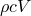

# 19.8 HeatCapacitance 对象


HeatCapacitance 对象定义部件或装配区域上的点热容。

HeatCapacitance 对象派生自 [Inertia](pt01ch19pyo09.md) 对象。

**访问**

```
import part
mdb.models[*name*].parts[*name*].engineeringFeatures.inertias[*name*]
import assembly
mdb.models[*name*].rootAssembly.engineeringFeatures.inertias[*name*]
```

### 19.8.1 HeatCapacitance(...)

此方法创建 HeatCapacitance 对象。

**路径**

```
mdb.models[*name*].parts[*name*].engineeringFeatures.HeatCapacitance
mdb.models[*name*].rootAssembly.engineeringFeatures.HeatCapacitance
```

**必需参数**

*name*

一个 String，指定存储库键。

*region*

一个 [Region](pt01ch45pyo03.md) 对象，指定应用热容的区域。

*table*

一个 Float 序列的序列，指定热容属性。表数据中的项目如下所述。

**可选参数**

*temperatureDependency*

一个 Boolean，指定数据是否取决于温度。默认值为 OFF。

*dependencies*

一个 Int，指定场变量依赖项的数量。默认值为 0。

**表数据**

表数据指定以下内容：
- 热容大小，（密度比热体积）。
- 温度（如果数据取决于温度）。
- 第一个场变量的值（如果数据取决于场变量）。
- 第二个场变量的值。
- 等等。

**返回值**

一个 HeatCapacitance 对象。

**异常**

无。

### 19.8.2 setValues(...)

此方法修改 HeatCapacitance 对象。

**必需参数**

无。

**可选参数**

`setValues` 的可选参数与 [HeatCapacitance](pt01ch19pyo08.md#ker-heatcapacitance-heatcapacitance-pyc) 方法的参数相同，但 *name* 参数除外。

**返回值**

无

**异常**

无。

### 19.8.3 成员

HeatCapacitance 对象具有与 [HeatCapacitance](pt01ch19pyo08.md#ker-heatcapacitance-heatcapacitance-pyc) 方法的参数相同的名称和描述的成员。

此外，HeatCapacitance 对象还有以下成员：

*suppressed*

一个 Boolean，指定惯性是否被抑制。默认值为 OFF。

### 19.8.4 对应的分析关键字

| [*HEATCAP](../key/key-link.md#usb-kws-mheatcap) |
| --- |


