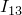

# 19.12 PointMassInertia 对象


PointMassInertia 对象定义部件或装配区域上的点质量和点转动惯性。

PointMassInertia 对象派生自 [Inertia](pt01ch19pyo09.md) 对象。

**访问**

```
import part
mdb.models[*name*].parts[*name*].engineeringFeatures.inertias[*name*]
import assembly
mdb.models[*name*].rootAssembly.engineeringFeatures.inertias[*name*]
```

### 19.12.1 PointMassInertia(...)

此方法创建 PointMassInertia 对象。

**路径**

```
mdb.models[*name*].parts[*name*].engineeringFeatures.PointMassInertia
mdb.models[*name*].rootAssembly.engineeringFeatures.PointMassInertia
```

**必需参数**

*name*

一个 String，指定存储库键。

*region*

一个 [Region](pt01ch45pyo03.md) 对象，指定应用质量或转动惯性的区域。

**可选参数**

*mass*

一个 Float，指定各向同性质量的质量大小。指定各向同性质量时不能指定此参数。默认值为 0.0。

*mass1*

一个 Float，指定各向异性质量在 1 方向的质量。指定各向同性质量时不能指定此参数。默认值为 0.0。

*mass2*

一个 Float，指定各向异性质量在 2 方向的质量。指定各向同性质量时不能指定此参数。默认值为 0.0。

*mass3*

一个 Float，指定各向异性质量在 3 方向的质量。指定各向同性质量时不能指定此参数。默认值为 0.0。

*i11*

一个 Float，指定关于局部 1 轴的转动惯性，。默认值为 0.0。

*i22*

一个 Float，指定关于局部 2 轴的转动惯性，。默认值为 0.0。

*i33*

一个 Float，指定关于局部 3 轴的转动惯性，。默认值为 0.0。

*i12*

一个 Float，指定惯性积，。默认值为 0.0。

*i13*

一个 Float，指定惯性积，。默认值为 0.0。

*i23*

一个 Float，指定惯性积，。默认值为 0.0。

*localCsys*

`None` 或一个 [DatumCsys](pt01ch15pyo03.md) 对象，指定各向异性质量项（当指定时）和转动惯性（当指定时）的局部坐标系。如果 *localCsys*=`None`，则在全局坐标系中定义各向异性质量和转动惯性数据。默认值为 `None`。

*alpha*

一个 Float，指定 alpha 阻尼大小。默认值为 0.0。

此参数仅适用于 Abaqus/Standard 分析。

*composite*

一个 Float，指定复合阻尼大小。默认值为 0.0。

此参数仅适用于 Abaqus/Standard 分析。

**返回值**

一个 PointMassInertia 对象。

**异常**

无。

### 19.12.2 setValues(...)

此方法修改 PointMassInertia 对象。

**必需参数**

无。

**可选参数**

`setValues` 的可选参数与 [PointMassInertia](pt01ch19pyo12.md#ker-pointmassinertia-pointmassinertia-pyc) 方法的参数相同，但 *name* 参数除外。

**返回值**

无

**异常**

无。

### 19.12.3 成员

PointMassInertia 对象具有与 [PointMassInertia](pt01ch19pyo12.md#ker-pointmassinertia-pointmassinertia-pyc) 方法的参数相同的名称和描述的成员。

此外，PointMassInertia 对象还有以下成员：

*suppressed*

一个 Boolean，指定惯性是否被抑制。默认值为 OFF。

### 19.12.4 对应的分析关键字

| [*MASS](../key/key-link.md#usb-kws-mmass), [*ROTARY INERTIA](../key/key-link.md#usb-kws-mrotinertia) |
| --- |


