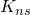
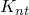
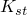

# 25.11 CohesiveBehavior 对象

CohesiveBehavior 对象为接触交互属性指定内聚行为。

**访问**

```
import interaction
mdb.models[*name*].interactionProperties[*name*].cohesiveBehavior
```

### 25.11.1 CohesiveBehavior(...)

此方法创建一个 CohesiveBehavior 对象。

**路径**

```
mdb.models[*name*].interactionProperties[*name*].CohesiveBehavior
```

**必需参数**

无。

**可选参数**

*repeatedContacts*

布尔值，指定是否为从属表面上在最终失效后重复接触的节点强制执行内聚行为。默认值为 OFF。

*eligibility*

 SymbolicConstant，指定符合条件的从属节点。可能的值为 ALL_NODES、INITIAL_NODES 和 SPECIFIED。默认值为 ALL_NODES。

*defaultPenalties*

布尔值，指定是否使用默认接触惩罚。默认值为 ON。

*coupling*

 SymbolicConstant，指定牵引力-分离系数是耦合还是解耦的。此参数仅在 *defaultPenalties*=OFF 时有效。可能的值为 UNCOUPLED 和 COUPLED。默认值为 UNCOUPLED。

*temperatureDependency*

布尔值，指定系数数据是否依赖于温度。此参数仅在 *defaultPenalties*=OFF 时有效。默认值为 OFF。

*dependencies*

整数，指定场变量的数量。此参数仅在 *defaultPenalties*=OFF 时有效。默认值为 0。

*table*

浮点数序列的序列，指定牵引力-分离系数。表格数据中的项目在下面描述。此参数仅在 *defaultPenalties*=OFF 时有效。

**表格数据**

如果 *coupling*=UNCOUPLED，表格数据指定以下内容：
- 法向刚度系数，。
- 第一个剪切方向的刚度系数，。
- 第二个剪切方向的刚度系数，。
- 温度（如果数据依赖于温度）。
- 第一个场变量的值（如果数据依赖于场变量）。
- 第二个场变量的值。
- 依此类推。

如果 *coupling*=COUPLED，表格数据指定以下内容：
- 法向刚度系数，。
- 第一个剪切方向的刚度系数，。
- 第二个剪切方向的刚度系数，。
- 耦合刚度系数，。
- 耦合刚度系数，。
- 耦合刚度系数，。
- 温度（如果数据依赖于温度）。
- 第一个场变量的值（如果数据依赖于场变量）。
- 第二个场变量的值。
- 依此类推。

**返回值**

CohesiveBehavior 对象。

**异常**

无。

### 25.11.2 setValues(...)

此方法修改 CohesiveBehavior 对象。

**必需参数**

无。

**可选参数**

`setValues` 的可选参数与 [CohesiveBehavior](pt01ch25pyo11.md#ker-cohesivebehavior-cohesivebehavior-pyc) 方法的参数相同。

**返回值**

无。

**异常**

无。

### 25.11.3 成员

CohesiveBehavior 对象的成员与 [CohesiveBehavior](pt01ch25pyo11.md#ker-cohesivebehavior-cohesivebehavior-pyc) 方法的参数具有相同的名称和描述。

### 25.11.4 对应的分析关键字

| [*COHESIVE BEHAVIOR](../key/key-link.md#usb-kws-mcohesivebehavior) |
| --- |


