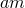
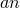
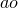

# 25.40 FractureCriterion 对象

FractureCriterion 对象为接触交互属性指定 fractureCriterion 选项。

**访问**

```
import interaction
mdb.models[*name*].interactionProperties[*name*].fractureCriterion
```

### 25.40.1 FractureCriterion(...)

此方法创建一个 FractureCriterion 对象。

**路径**

```
mdb.models[*name*].interactionProperties[*name*].FractureCriterion
```

**必需参数**

*initTable*

浮点数序列的序列，指定定义断裂准则的值。表格数据中的项目在下面描述。

**可选参数**

*type*

 SymbolicConstant，指定用于定义断裂准则的数据类型。可能的值为 VCCT 和 ENHANCED VCCT。默认值为 VCCT。

*mixedModeBehavior*

 SymbolicConstant，指定用于定义断裂准则的混合模式行为类型。可能的值为 BK、POWER 和 REEDER。默认值为 BK。

*temperatureDependency*

布尔值，指定断裂准则数据是否依赖于温度。默认值为 OFF。

*dependencies*

整数，指定断裂准则数据场变量的数量。默认值为 0。

*tolerance*

浮点数，指定 VCCT\Enhanced VCCT 类型的容差。默认值为 0.2。

*specifyUnstableCrackProp*

 SymbolicConstant，指定是否在断裂准则中包含不稳定裂纹增长容差。可能的值为 ON 和 OFF。默认值为 OFF。

*unstableTolerance*

 SymbolicConstant DEFAULT 或浮点数，指定不稳定裂纹扩展的容差。仅在 *specifyUnstableCrackProp*=ON 时指定此参数。默认值为 DEFAULT。

**表格数据**

*initTable* 的表格数据：

如果 *type*=VCCT 且 *mixedModeBehavior*=BK 或 REEDER，表格数据指定以下内容：
- I 模式临界能量释放率，。
- II 模式临界能量释放率，。
- III 模式临界能量释放率，。
- 指数，。
- 温度（如果数据依赖于温度）。
- 第一个场变量的值（如果数据依赖于场变量）。
- 第二个场变量的值。
- 依此类推。

如果 *type*=VCCT 且 *mixedModeBehavior*=POWER，表格数据指定以下内容：
- I 模式临界能量释放率，。
- II 模式临界能量释放率，。
- III 模式临界能量释放率，。
- 指数，。
- 指数，。
- 指数，。
- 第一个场变量的值（如果数据依赖于场变量）。
- 第二个场变量的值。
- 依此类推。

如果 *type*=ENHANCED VCCT 且 *mixedModeBehavior*=BK 或 REEDER，表格数据指定以下内容：
- 裂纹起始的 I 模式临界能量释放率，。
- 裂纹起始的 II 模式临界能量释放率，。
- 裂纹起始的 III 模式临界能量释放率，。
- 裂纹扩展的 I 模式临界能量释放率，。
- 裂纹扩展的 II 模式临界能量释放率，。
- 裂纹扩展的 III 模式临界能量释放率，。
- 指数，。
- 温度（如果数据依赖于温度）。
- 第一个场变量的值（如果数据依赖于场变量）。
- 第二个场变量的值。
- 依此类推。

如果 *type*=ENHANCED VCCT 且 *mixedModeBehavior*=POWER，表格数据指定以下内容：
- 裂纹起始的 I 模式临界能量释放率，。
- 裂纹起始的 II 模式临界能量释放率，。
- 裂纹起始的 III 模式临界能量释放率，。
- 裂纹扩展的 I 模式临界能量释放率，。
- 裂纹扩展的 II 模式临界能量释放率，。
- 裂纹扩展的 III 模式临界能量释放率，。
- 指数，。
- 指数，。
- 指数，。
- 第一个场变量的值（如果数据依赖于场变量）。
- 第二个场变量的值。
- 依此类推。

**返回值**

FractureCriterion 对象。

**异常**

无。

### 25.40.2 setValues(...)

此方法修改 FractureCriterion 对象。

**必需参数**

无。

**可选参数**

`setValues` 的可选参数与 [FractureCriterion](pt01ch25pyo40.md#ker-fracturecriterion-fracturecriterion-pyc) 方法的参数相同。

**返回值**

无。

**异常**

无。

### 25.40.3 成员

FractureCriterion 对象的成员与 [FractureCriterion](pt01ch25pyo40.md#ker-fracturecriterion-fracturecriterion-pyc) 方法的参数具有相同的名称和描述。

### 25.40.4 对应的分析关键字

| [*FRACTURE CRITERION](../key/key-link.md#usb-kws-hfracturecriterion) |
| --- |


