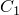

# 29.100 Trs object


The Trs object defines the temperature-time shift for time history viscoelastic analysis.

**Access**

```
import material
mdb.models[*name*].materials[*name*].viscoelastic.trs
mdb.models[*name*].materials[*name*].viscosity.trs
import odbMaterial
session.odbs[*name*].materials[*name*].viscoelastic.trs
session.odbs[*name*].materials[*name*].viscosity.trs
```

### 29.100.1 Trs(...)

This method creates a Trs object.

**Path**

```
mdb.models[*name*].materials[*name*].viscoelastic.Trs
mdb.models[*name*].materials[*name*].viscosity.Trs
session.odbs[*name*].materials[*name*].viscoelastic.Trs
session.odbs[*name*].materials[*name*].viscosity.Trs
```

**Required arguments**

None.

**Optional arguments**

*definition*

A SymbolicConstant specifying the definition of the shift function. Possible values are WLF, ARRHENIUS, and USER. The default value is WLF.

*table*

A sequence of sequences of Floats specifying the items described below. The default value is an empty sequence.

This argument is valid only when *definition*=WLF.

**Table data**

- Reference temperature, .
- Calibration constant, .
- Calibration constant, .

**Return value**

A Trs object.

**Exceptions**

None.

### 29.100.2 setValues(...)

This method modifies the Trs object.

**Required arguments**

None.

**Optional arguments**

The optional arguments to `setValues` are the same as the arguments to the [Trs](pt01ch29pyo100.md#ker-trs-trs-pyc) method.

**Return value**

None

**Exceptions**

None.

### 29.100.3 Members

The Trs object has members with the same names and descriptions as the arguments to the [Trs](pt01ch29pyo100.md#ker-trs-trs-pyc) method.

### 29.100.4 Corresponding analysis keywords

| [*TRS](../key/key-link.md#usb-kws-mtrs) |
| --- |


