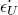

# 29.101 UniaxialTestData 对象

UniaxialTestData 对象提供单轴测试数据（压缩和/或拉伸）。

**访问**

```
import material
mdb.models[*name*].materials[*name*].hyperelastic.uniaxialTestData
mdb.models[*name*].materials[*name*].hyperfoam.uniaxialTestData
mdb.models[*name*].materials[*name*].lowDensityFoam\
.uniaxialCompressionTestData
mdb.models[*name*].materials[*name*].lowDensityFoam\
.uniaxialTensionTestData
mdb.models[*name*].materials[*name*].mullinsEffect.uniaxialTests[*i*]
import odbMaterial
session.odbs[*name*].materials[*name*].hyperelastic.uniaxialTestData
session.odbs[*name*].materials[*name*].hyperfoam.uniaxialTestData
session.odbs[*name*].materials[*name*].lowDensityFoam\
.uniaxialCompressionTestData
session.odbs[*name*].materials[*name*].lowDensityFoam\
.uniaxialTensionTestData
session.odbs[*name*].materials[*name*].mullinsEffect.uniaxialTests[*i*]
```

### 29.101.1 UniaxialTestData(...)

此方法创建 UniaxialTestData 对象。

**路径**

```
mdb.models[*name*].materials[*name*].hyperelastic.UniaxialTestData
mdb.models[*name*].materials[*name*].hyperfoam.UniaxialTestData
mdb.models[*name*].materials[*name*].lowDensityFoam.UniaxialTestData
mdb.models[*name*].materials[*name*].mullinsEffect.UniaxialTestData
session.odbs[*name*].materials[*name*].hyperelastic.UniaxialTestData
session.odbs[*name*].materials[*name*].hyperfoam.UniaxialTestData
session.odbs[*name*].materials[*name*].lowDensityFoam.UniaxialTestData
session.odbs[*name*].materials[*name*].mullinsEffect.UniaxialTestData
```

**必需参数**

*table*

Float 元组序列，指定下述项目。

**可选参数**

*smoothing*

`None` 或 Int，指定平滑值。如果 *smoothing*=`None`，则不使用平滑。默认值为 `None`。

*lateralNominalStrain*

Boolean，指定是否包含横向名义应变。默认值为 OFF。

*temperatureDependency*

Boolean，指定数据是否依赖于温度。默认值为 OFF。

*dependencies*

Int，指定场变量依赖项的数量。默认值为 0。

**表格数据**

对于超弹性材料模型，表格数据指定以下内容：
- 名义应力，。
- 名义应变，。

对于超泡沫材料模型，表格数据指定以下内容：
- 名义应力，。
- 名义应变，。
- 名义横向应变，。默认值为 0。

对于低密度泡沫材料模型，表格数据指定以下内容：
- 名义应力，。
- 名义应变，。
- 名义应变率，。

**返回值**

UniaxialTestData 对象。

**异常**

无。

### 29.101.2 setValues(...)

此方法修改 UniaxialTestData 对象。

**必需参数**

无。

**可选参数**

`setValues` 的可选参数与 [UniaxialTestData](pt01ch29pyo101.md#ker-uniaxialtestdata-uniaxialtestdata-pyc) 方法的参数相同。

**返回值**

无

**异常**

无。

### 29.101.3 成员

UniaxialTestData 对象的成员与 [UniaxialTestData](pt01ch29pyo101.md#ker-uniaxialtestdata-uniaxialtestdata-pyc) 方法的参数具有相同的名称和描述。

### 29.101.4 对应的分析关键字

| [*UNIAXIAL TEST DATA](../key/key-link.md#usb-kws-munitestdata) |
| --- |
