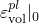

# 29.16 ClayPlasticity 对象


ClayPlasticity 对象指定扩展 Cam-粘土塑性模型。

**访问**

```
import material
mdb.models[*name*].materials[*name*].clayPlasticity
import odbMaterial
session.odbs[*name*].materials[*name*].clayPlasticity
```

### 29.16.1 ClayPlasticity(...)

此方法创建 ClayPlasticity 对象。

**路径**

```
mdb.models[*name*].materials[*name*].ClayPlasticity
session.odbs[*name*].materials[*name*].ClayPlasticity
```

**必需参数**

*table*

一个 Float 序列的序列，指定如下所述的项目。

**可选参数**

*intercept*

`None` 或一个 Float，指定 ，即在孔隙比与压力应力对数的关系图中，原状固结线与孔隙比轴的截距。默认值为 `None`。

此参数仅在 *hardening*=EXPONENTIAL 时有效。

*hardening*

一个 SymbolicConstant，指定硬化/软化定义类型。可能的值为 EXPONENTIAL 和 TABULAR。默认值为 EXPONENTIAL。

*temperatureDependency*

一个 Boolean，指定数据是否依赖于温度。默认值为 OFF。

*dependencies*

一个 Int，指定场变量依赖数量。默认值为 0。

**表格数据**

如果 *hardening*=EXPONENTIAL，表格数据指定以下内容：
- 对数塑性体积模量，（无量纲）。
- 临界状态应力比，。
- 初始屈服面大小，。
- ，定义临界状态"湿"侧屈服面大小的参数。
- ，三轴拉伸流动应力与三轴压缩流动应力的比值。。如果接受默认值 0.0，则假定值为 1.0。
- 温度（如果数据依赖于温度）。
- 第一个场变量的值（如果数据依赖于场变量）。
- 第二个场变量的值。
- 依此类推。

如果 *hardening*=TABULAR，表格数据指定以下内容：
- 临界状态应力比，。
- 对应  的初始体积塑性应变，，根据 [ClayHardening](pt01ch29pyo15.md) 定义。
- ，定义临界状态"湿"侧屈服面大小的参数。
- ，三轴拉伸流动应力与三轴压缩流动应力的比值。。
- 温度（如果数据依赖于温度）。
- 第一个场变量的值（如果数据依赖于场变量）。
- 第二个场变量的值。
- 依此类推。

**返回值**

一个 ClayPlasticity 对象。

**异常**

RangeError。

### 29.16.2 setValues(...)

此方法修改 ClayPlasticity 对象。

**必需参数**

无。

**可选参数**

`setValues` 的可选参数与 [ClayPlasticity](pt01ch29pyo16.md#ker-clayplasticity-clayplasticity-pyc) 方法的参数相同。

**返回值**

无

**异常**

RangeError。

### 29.16.3 成员

ClayPlasticity 对象具有与 [ClayPlasticity](pt01ch29pyo16.md#ker-clayplasticity-clayplasticity-pyc) 方法参数同名的成员，描述也相同。

此外，ClayPlasticity 对象可以具有以下成员：

*clayHardening*

一个 [ClayHardening](pt01ch29pyo15.md) 对象。

### 29.16.4 对应的分析关键字

| [*CLAY PLASTICITY](../key/key-link.md#usb-kws-mclayplast) |
| --- |


