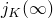
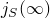
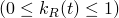
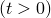
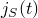
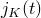
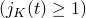

# 29.17 CombinedTestData 对象


CombinedTestData 对象同时指定归一化剪切和体积柔量或松弛模量随时间变化的函数。

**访问**

```
import material
mdb.models[*name*].materials[*name*].viscoelastic.combinedTestData
import odbMaterial
session.odbs[*name*].materials[*name*].viscoelastic.combinedTestData
```

### 29.17.1 CombinedTestData(...)

此方法创建 CombinedTestData 对象。

**路径**

```
mdb.models[*name*].materials[*name*].viscoelastic.CombinedTestData
session.odbs[*name*].materials[*name*].viscoelastic.CombinedTestData
```

**必需参数**

*table*

一个 Float 序列的序列，指定如下所述的项目。表格数据的值取决于 [Viscoelastic](pt01ch29pyo106.md) 对象的 *time* 成员的值。

**可选参数**

*volinf*

`None` 或一个 Float，指定归一化体积。*volinf* 的值取决于 [Viscoelastic](pt01ch29pyo106.md) 对象的 *time* 成员的值。默认值为 `None`。

如果 *time*=RELAXATION_TEST_DATA，*volinf* 指定长期归一化体积模量， 的值。

如果 *time*=CREEP_TEST_DATA，*volinf* 指定长期归一化体积柔量， 的值。

*shrinf*

`None` 或一个 Float，指定归一化剪切。*shrinf* 的值取决于 [Viscoelastic](pt01ch29pyo106.md) 对象的 *time* 成员的值。默认值为 `None`。

如果 *time*=RELAXATION_TEST_DATA，*shrinf* 指定长期归一化剪切模量， 的值。

如果 *time*=CREEP_TEST_DATA，*shrinf* 指定长期归一化剪切柔量， 的值。

**表格数据**

如果 *time*=RELAXATION_TEST_DATA，表格数据指定以下内容：
- 归一化剪切模量， 。
- 归一化体积（体积）模量， 。
- 时间  。

如果 *time*=CREEP_TEST_DATA，表格数据指定以下内容：
- 归一化剪切柔量， 。
- 归一化体积（体积）柔量， 。
- 时间  。

**返回值**

一个 CombinedTestData 对象。

**异常**

无。

### 29.17.2 setValues(...)

此方法修改 CombinedTestData 对象。

**必需参数**

无。

**可选参数**

`setValues` 的可选参数与 [CombinedTestData](pt01ch29pyo17.md#ker-combinedtestdata-combinedtestdata-pyc) 方法的参数相同。

**返回值**

无

**异常**

无。

### 29.17.3 成员

CombinedTestData 对象具有与 [CombinedTestData](pt01ch29pyo17.md#ker-combinedtestdata-combinedtestdata-pyc) 方法参数同名的成员，描述也相同。

### 29.17.4 对应的分析关键字

| [*COMBINED TEST DATA](../key/key-link.md#usb-kws-mcombinedtestdata) |
| --- |


