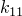
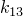

# 29.24 Conductivity 对象


Conductivity 对象指定热导率。

**访问**

```
import material
mdb.models[*name*].materials[*name*].conductivity
import odbMaterial
session.odbs[*name*].materials[*name*].conductivity
```

### 29.24.1 Conductivity(...)

此方法创建 Conductivity 对象。

**路径**

```
mdb.models[*name*].materials[*name*].Conductivity
session.odbs[*name*].materials[*name*].Conductivity
```

**必需参数**

*table*

一个 Float 序列的序列，指定如下所述的项目。

**可选参数**

*type*

一个 SymbolicConstant，指定电导率类型。可能的值为 ISOTROPIC、ORTHOTROPIC 和 ANISOTROPIC。默认值为 ISOTROPIC。

*temperatureDependency*

一个 Boolean，指定数据是否依赖于温度。默认值为 OFF。

*dependencies*

一个 Int，指定场变量依赖数量。默认值为 0。

**表格数据**

如果 *type*=ISOTROPIC，表格数据指定以下内容：
- 电导率，。
- 温度（如果数据依赖于温度）。
- 第一个场变量的值（如果数据依赖于场变量）。
- 第二个场变量的值。
- 依此类推。

如果 *type*=ORTHOTROPIC，表格数据指定以下内容：
- 。
- 。
- 。
- 温度（如果数据依赖于温度）。
- 第一个场变量的值（如果数据依赖于场变量）。
- 第二个场变量的值。
- 依此类推。

如果 *type*=ANISOTROPIC，表格数据指定以下内容：
- 。
- 。
- 。
- 。
- 。
- 。
- 温度（如果数据依赖于温度）。
- 第一个场变量的值（如果数据依赖于场变量）。
- 第二个场变量的值。
- 依此类推。

**返回值**

一个 Conductivity 对象。

**异常**

RangeError。

### 29.24.2 setValues(...)

此方法修改 Conductivity 对象。

**必需参数**

无。

**可选参数**

`setValues` 的可选参数与 [Conductivity](pt01ch29pyo24.md#ker-conductivity-conductivity-pyc) 方法的参数相同。

**返回值**

无

**异常**

RangeError。

### 29.24.3 成员

Conductivity 对象具有与 [Conductivity](pt01ch29pyo24.md#ker-conductivity-conductivity-pyc) 方法参数同名的成员，描述也相同。

### 29.24.4 对应的分析关键字

| [*CONDUCTIVITY](../key/key-link.md#usb-kws-mconductivity) |
| --- |


