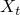
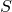

# 29.51 FailStress 对象

FailStress 对象定义基于应力的失效度量参数。

**访问**

```
import material
mdb.models[*name*].materials[*name*].elastic.failStress
import odbMaterial
session.odbs[*name*].materials[*name*].elastic.failStress
```

### 29.51.1 FailStress(...)

此方法创建 FailStress 对象。

**路径**

```
mdb.models[*name*].materials[*name*].elastic.FailStress
session.odbs[*name*].materials[*name*].elastic.FailStress
```

**必需参数**

*table*

 Float 元组序列，指定下述项目。

**可选参数**

*temperatureDependency*

 Boolean，指定数据是否依赖于温度。默认值为 OFF。

*dependencies*

 Int，指定场变量依赖项的数量。默认值为 0。

**表格数据**

- 纤维方向拉伸应力极限，。
- 纤维方向压缩应力极限，。
- 横向拉伸应力极限，。
- 横向压缩应力极限，。
- -- 平面中的剪切强度，。
- 交叉乘积项系数，（）。默认值为零。
- 双轴应力极限，。
- 温度（如果数据依赖于温度）。
- 第一个场变量的值（如果数据依赖于场变量）。
- 第二个场变量的值。
- 以此类推。

**返回值**

 FailStress 对象。

**异常**

 RangeError。

### 29.51.2 setValues(...)

此方法修改 FailStress 对象。

**必需参数**

无。

**可选参数**

 `setValues` 的可选参数与 [FailStress](pt01ch29pyo51.md#ker-failstress-failstress-pyc) 方法的参数相同。

**返回值**

无

**异常**

 RangeError。

### 29.51.3 成员

FailStress 对象的成员与 [FailStress](pt01ch29pyo51.md#ker-failstress-failstress-pyc) 方法的参数具有相同的名称和描述。

### 29.51.4 对应的分析关键字

| [*FAIL STRESS](../key/key-link.md#usb-kws-mefailstress) |
| --- |
