# 29.75 Piezoelectric 对象

Piezoelectric 对象指定压电材料属性。

**访问**

```
import material
mdb.models[*name*].materials[*name*].piezoelectric
import odbMaterial
session.odbs[*name*].materials[*name*].piezoelectric
```

### 29.75.1 Piezoelectric(...)

此方法创建 Piezoelectric 对象。

**路径**

```
mdb.models[*name*].materials[*name*].Piezoelectric
session.odbs[*name*].materials[*name*].Piezoelectric
```

**必需参数**

*table*

Float 元组序列，指定下述项目。

**可选参数**

*type*

SymbolicConstant，指定压电属性的材料系数类型。可能的值为 STRAIN 和 STRESS。默认值为 STRESS。

*temperatureDependency*

Boolean，指定数据是否依赖于温度。默认值为 OFF。

*dependencies*

Int，指定场变量依赖项的数量。默认值为 0。

**表格数据**

如果 *type*=STRESS，表格数据指定以下内容：
- 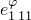。
- 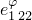。
- 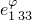。
- 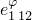。
- 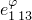。
- 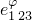。
- 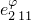。
- 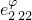。
- 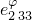。
- 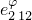。
- 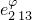。
- 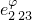。
- 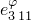。
- 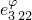。
- 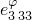。
- 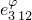。
- 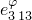。
- 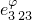。
- 温度（如果数据依赖于温度）。
- 第一个场变量的值（如果数据依赖于场变量）。
- 第二个场变量的值。
- 以此类推。

如果 *type*=STRAIN，表格数据指定以下内容：
- 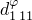。
- 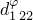。
- 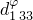。
- 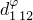。
- 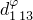。
- 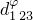。
- 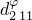。
- 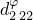。
- 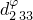。
- 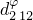。
- 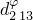。
- 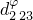。
- 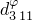。
- 。
- 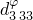。
- 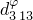。
- 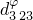。
- 温度（如果数据依赖于温度）。
- 第一个场变量的值（如果数据依赖于场变量）。
- 第二个场变量的值。
- 以此类推。

**返回值**

Piezoelectric 对象。

**异常**

无。

### 29.75.2 setValues(...)

此方法修改 Piezoelectric 对象。

**必需参数**

无。

**可选参数**

`setValues` 的可选参数与 [Piezoelectric](pt01ch29pyo75.md#ker-piezoelectric-piezoelectric-pyc) 方法的参数相同。

**返回值**

无

**异常**

无。

### 29.75.3 成员

Piezoelectric 对象的成员与 [Piezoelectric](pt01ch29pyo75.md#ker-piezoelectric-piezoelectric-pyc) 方法的参数具有相同的名称和描述。

### 29.75.4 对应的分析关键字

| [*PIEZOELECTRIC](../key/key-link.md#usb-kws-mpiezoelect) |
| --- |
