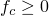

# 29.81 PorousFailureCriteria 对象

PorousFailureCriteria 对象指定多孔金属的材料失效标准。

**访问**

```
import material
mdb.models[*name*].materials[*name*].porousMetalPlasticity\
.porousFailureCriteria
import odbMaterial
session.odbs[*name*].materials[*name*].porousMetalPlasticity\
.porousFailureCriteria
```

### 29.81.1 PorousFailureCriteria(...)

此方法创建 PorousFailureCriteria 对象。

**路径**

```
mdb.models[*name*].materials[*name*].porousMetalPlasticity\
.PorousFailureCriteria
session.odbs[*name*].materials[*name*].porousMetalPlasticity\
.PorousFailureCriteria
```

**必需参数**

无。

**可选参数**

*fraction*

Float，指定完全失效时的孔隙体积分数，。默认值为 1.0。

*criticalFraction*

Float，指定临界孔隙体积分数，。默认值为 1.0。

**返回值**

PorousFailureCriteria 对象。

**异常**

RangeError。

### 29.81.2 setValues(...)

此方法修改 PorousFailureCriteria 对象。

**必需参数**

无。

**可选参数**

`setValues` 的可选参数与 [PorousFailureCriteria](pt01ch29pyo81.md#ker-porousfailurecriteria-porousfailurecriteria-pyc) 方法的参数相同。

**返回值**

无

**异常**

RangeError。

### 29.81.3 成员

PorousFailureCriteria 对象的成员与 [PorousFailureCriteria](pt01ch29pyo81.md#ker-porousfailurecriteria-porousfailurecriteria-pyc) 方法的参数具有相同的名称和描述。

### 29.81.4 对应的分析关键字

| [*POROUS FAILURE CRITERIA](../key/key-link.md#usb-kws-mporfailcriteria) |
| --- |
