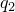

# 29.82 PorousMetalPlasticity 对象

PorousMetalPlasticity 对象指定多孔金属塑性模型。

**访问**

```
import material
mdb.models[*name*].materials[*name*].porousMetalPlasticity
import odbMaterial
session.odbs[*name*].materials[*name*].porousMetalPlasticity
```

### 29.82.1 PorousMetalPlasticity(...)

此方法创建 PorousMetalPlasticity 对象。

**路径**

```
mdb.models[*name*].materials[*name*].PorousMetalPlasticity
session.odbs[*name*].materials[*name*].PorousMetalPlasticity
```

**必需参数**

*table*

Float 元组序列，指定下述项目。

**可选参数**

*relativeDensity*

`None` 或 Float，指定材料的初始相对密度，。默认值为 `None`。

*temperatureDependency*

Boolean，指定数据是否依赖于温度。默认值为 OFF。

*dependencies*

Int，指定场变量依赖项的数量。默认值为 0。

**表格数据**

- 。
- 。
- 。
- 温度（如果数据依赖于温度）。
- 第一个场变量的值（如果数据依赖于场变量）。
- 第二个场变量的值。
- 以此类推。

**返回值**

PorousMetalPlasticity 对象。

**异常**

RangeError。

### 29.82.2 setValues(...)

此方法修改 PorousMetalPlasticity 对象。

**必需参数**

无。

**可选参数**

`setValues` 的可选参数与 [PorousMetalPlasticity](pt01ch29pyo82.md#ker-porousmetalplasticity-porousmetalplasticity-pyc) 方法的参数相同。

**返回值**

无

**异常**

RangeError。

### 29.82.3 成员

PorousMetalPlasticity 对象的成员与 [PorousMetalPlasticity](pt01ch29pyo82.md#ker-porousmetalplasticity-porousmetalplasticity-pyc) 方法的参数具有相同的名称和描述。

此外，PorousMetalPlasticity 对象可以具有以下成员：

*porousFailureCriteria*

[PorousFailureCriteria](pt01ch29pyo81.md) 对象。

*voidNucleation*

[VoidNucleation](pt01ch29pyo109.md) 对象。

### 29.82.4 对应的分析关键字

| [*POROUS METAL PLASTICITY](../key/key-link.md#usb-kws-mpormetalplas) |
| --- |
