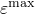

# 29.89 ShearRetention 对象

ShearRetention 对象定义 [Concrete](pt01ch29pyo18.md) 模型中与裂纹面相关的剪切模量降低，作为裂纹间拉伸应变的函数。

**访问**

```
import material
mdb.models[*name*].materials[*name*].concrete.shearRetention
import odbMaterial
session.odbs[*name*].materials[*name*].concrete.shearRetention
```

### 29.89.1 ShearRetention(...)

此方法创建 ShearRetention 对象。

**路径**

```
mdb.models[*name*].materials[*name*].concrete.ShearRetention
session.odbs[*name*].materials[*name*].concrete.ShearRetention
```

**必需参数**

*table*

Float 元组序列，指定下述项目。

**可选参数**

*temperatureDependency*

Boolean，指定数据是否依赖于温度。默认值为 OFF。

*dependencies*

Int，指定场变量依赖项的数量。默认值为 0。

**表格数据**

- 干混凝土的 。默认值为 1.0。
- 干混凝土的 。默认值为非常大的数（完全剪切保持）。
- 湿混凝土的 。默认值为 1.0。
- 湿混凝土的 。默认值为非常大的数（完全剪切保持）。
- 温度（如果数据依赖于温度）。
- 第一个场变量的值（如果数据依赖于场变量）。
- 第二个场变量的值。
- 以此类推。

**返回值**

ShearRetention 对象。

**异常**

RangeError。

### 29.89.2 setValues(...)

此方法修改 ShearRetention 对象。

**必需参数**

无。

**可选参数**

`setValues` 的可选参数与 [ShearRetention](pt01ch29pyo89.md#ker-shearretention-shearretention-pyc) 方法的参数相同。

**返回值**

无

**异常**

RangeError。

### 29.89.3 成员

ShearRetention 对象的成员与 [ShearRetention](pt01ch29pyo89.md#ker-shearretention-shearretention-pyc) 方法的参数具有相同的名称和描述。

### 29.89.4 对应的分析关键字

| [*SHEAR RETENTION](../key/key-link.md#usb-kws-mshearretention) |
| --- |
